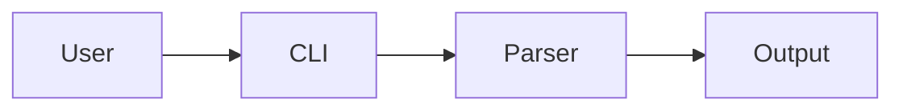

# Skill: github-presence

> **Decaimento Temporal**
> Ultima verificacao: 2026-05-08 | Proxima revisao: 2026-11-08 | Volatility: **medium** (6 meses)
> Features GitHub evoluem moderadamente (Sponsors, Discussions, Actions, Stars program). Algoritmo Trending estavel em principios (velocity), mas tatica de launch evolui. Brand Guidelines 2026 oficial publicado abr/2026 (89p). **Re-validar antes de campanha:**
> - GitHub Docs — https://docs.github.com
> - GitHub Brand Toolkit 2026 — https://brand.github.com
> - awesome-github-profile-readme — https://github.com/abhisheknaiidu/awesome-github-profile-readme
> - awesome-readme — https://github.com/matiassingers/awesome-readme
> - GitHub Sponsors — https://github.com/sponsors
> - Trendshift (trending insights) — https://trendshift.io
> - GitHub Stars program — https://stars.github.com
>
> **Acionamento:** profile README pessoal/dev; organization page company; repository README design; GitHub SEO discoverability; launch open-source project; awesome-list strategy; GitHub Sponsors monetization; employer branding via GitHub; GitHub Pages site; GitHub Actions CI/CD para visibilidade; analise de competidor open-source.
> **Skills relacionadas:** `multi-platform-narrative` (proxima — adapta narrativa GitHub→outras), `escrita-por-publico` (developer audience tom), `seo-on-page` (SEO crossover), `seo-keywords`, `branding`, `comunicacao-corporativa`, `linkedin-organico` (announce launches), `composicao-visual` (banner+logo profile/org), `audio-musica-ia` (NA — GitHub e text-first).
> **Pre-requisito:** ter conta GitHub + projeto/produto/persona tecnica.

---

## 1. Visao Geral

GitHub e canal de marketing **tecnico** e **subestimado** — 100M+ developers ativos globalmente, alta credibilidade ("GitHub stars = social proof tecnico"), audiencia high-intent (devs buscam ferramentas para usar/integrar), zero CPC quando organic. Cases:

- **AFFiNE** (knowledge base open-source): 60K stars total, 33K em 18 meses (Jul 2023 - Dez 2024)
- **Caleb Porzio** (Livewire/Alpine.js): **$112k+/ano** GitHub Sponsors, **$1M total** lifetime
- **Tanner Linsley** (React Query/TanStack): **$45k/mes** Sponsors em 2 anos
- **Vercel/Next.js**: GitHub-driven distribution + dev marketing model

Esta skill cobre 7 fundacoes:

1. **Profile README pessoal** — developer brand individual.
2. **Organization page company** — brand corporativo + employer.
3. **Repository README** — 10s time-to-value loop.
4. **GitHub SEO + topics** — discoverability via search.
5. **Launch tactics** — 48h concentrado HN/PH/Reddit/X.
6. **Awesome-lists distribution** — permanente high-DA.
7. **GitHub Sponsors monetization** — 100% repasse personal.

Mais 3 aplicacoes:

8. **Documentation site** — GitHub Pages + Mintlify + Docusaurus.
9. **GitHub Actions visibility** — CI/CD + workflows publicos.
10. **Employer branding** — 75% job seekers research GitHub.

### 1.1 Acionamento

| Gatilho | Exemplo |
|---------|---------|
| Profile README pessoal | "vou virar developer freelancer — profile README como otimizar?" |
| Organization page | "startup B2B — organization page GitHub setup?" |
| Repo README design | "lib npm aberta + README converte mal — diagnostico?" |
| GitHub SEO | "como aparecer GitHub search 'react state management'?" |
| Launch open-source | "projeto pronto — qual playbook para 1k stars primeiros 90 dias?" |
| Awesome-list submission | "como entrar awesome-react?" |
| GitHub Sponsors setup | "ativar Sponsors faz sentido para meu projeto?" |
| Employer branding | "tech recruiter usa GitHub — como deixar org atraente?" |
| GitHub Pages docs | "docs.* site GitHub Pages OR Mintlify?" |
| Competidor analysis | "audit GitHub presence vs competidor X" |

### 1.2 Pre-requisitos

- [ ] **Conta GitHub** ativa (pessoal e/ou organization).
- [ ] **Projeto/produto** com proposta clara.
- [ ] **Persona tecnica** definida (dev backend Python? frontend React? data scientist?).
- [ ] **GitHub PRO** (free tier suficiente para maioria) ou Team/Enterprise (orgs).
- [ ] **Documentation source** (README, docs/, wiki, blog).

> **Cristal C0 — NAO CHUTAR.** GitHub stars sem retencao = vanity. Profile README bonito sem clareza = first-impression-failed. Repo abandonado = anti-marketing (developers verificam last commit). Re-validar com analytics (clones, traffic, stars velocity), retention (issues/PRs ativos), conversao (stars → npm/install/deploys).

---

## 2. Cenario 2026 — GitHub como canal marketing

### 2.1 Por que GitHub matters

```
100M+ DEVELOPERS GLOBAL
   - Maior audiencia high-intent tecnica
   - 70% Fortune 500 usa GitHub
   - 90M users active monthly

CREDIBILIDADE TECNICA UNICA
   - Code visivel = transparencia max
   - Stars = social proof publico
   - Activity = sinal de "alive project"

ZERO CPC ORGANIC
   - GitHub Trending (1k+ stars dia = visibility massiva)
   - Awesome-lists (permanente high-DA)
   - HN/Reddit organic spikes

DEVELOPER FUNNEL
   - Awareness: README + topics
   - Consideration: docs + examples
   - Trial: clone/install
   - Activation: working integration
   - Advocacy: stars + tweets + blog
```

### 2.2 Stats 2026

```
HACKER NEWS IMPACT (study arxiv 2024)
   +121 stars / 24h average
   +189 stars / 48h
   +289 stars / 1 semana
   = HN front-page = single most impactful launch event

LAUNCH CONCENTRADO vs DISTRIBUTED
   48h pico (HN + Reddit + PH + X simultaneo) >> 1 sem distribuido
   = velocity triggers GitHub Trending algorithm

AFFiNE CASE
   60K stars / 33K em 18 meses
   Investment: comunidade-first + 10s time-to-value + sequential launches
   ROI: $bilhoes valuation Series A based em traction

EMPLOYER BRANDING 2026
   75% job seekers research empregador antes de apply
   AI synthesizes employer summaries (ChatGPT, Perplexity)
   GitHub presence = sinal forte
```

### 2.3 GitHub Brand Toolkit 2026 oficial

```
Lancado abr/2026 — 89 paginas

Inclui:
   - Logo guidelines (lockup invertocat + wordmark)
   - Color palette oficial
   - Typography (Mona Sans variable font)
   - Iconography (Octicons)
   - Voice + tone

Use:
   - Dont misuse logo
   - Comply when integrating GitHub-related products
```

---

## 3. Profile README pessoal — developer brand

### 3.1 Anatomia profile README iconico

```
ESTRUTURA RECOMENDADA 2026 (top-down)

1. HEADER (banner + name + headline 1 line)
2. ABOUT (3-5 lines — focus claro)
3. CURRENT WORK (que estou construindo)
4. STACK (badges/tags principais)
5. STATS (dinamicos — ReadMe Stats, Streak)
6. PROJECTS PINNED (3-6 melhores)
7. CONNECT (LinkedIn/X/blog/email)
```

### 3.2 Headline — first impression critica

```
EXEMPLOS BONS:
   "Building open-source tools for developer productivity"
   "Senior backend engineer @ Stripe — Python, Go, distributed systems"
   "Indie maker. Building [Product] (10k+ users). Open-source enthusiast."

EXEMPLOS RUINS:
   "Software engineer passionate about technology"
   "Developer who loves coding"
   "Just trying to learn"

REGRA: 5-15 palavras. Concreto. Diferenciado.
```

### 3.3 Dynamic widgets

```
README STATS (anuraghazra/github-readme-stats)
   

MOST USED LANGUAGES
   

STREAK STATS (DenverCoder1/github-readme-streak-stats)
   

ACTIVITY GRAPH
   

PROFILE VIEWS
   

WAKATIME (coding time tracking)
   
```

### 3.4 Pinned repositories (6 max)

```
ESTRATEGIA PINNED

OPCAO A — TOP PROJETOS (por stars)
   Mostra credibilidade tecnica

OPCAO B — RECENT WORK
   Mostra atividade + relevance

OPCAO C — DIVERSITY (linguagens/tipos)
   Backend + frontend + tooling + lib + cli

RECOMENDACAO
   3 top projects + 2 recent + 1 wildcard (passion project)
   = balanco credibility + atividade + personality
```

### 3.5 Anti-patterns profile README

| Anti-pattern | Por que falha |
|--------------|---------------|
| Headline generico | Naoe diferencia |
| 50+ badges tech stack | Wall of noise |
| Stats fake/inflated | Detectavel + credibilidade quebra |
| Sem pinned repos | Profile vazio |
| Pinned repos abandoned 1+ ano | Sinal "dead" |
| Banner GIF aleatorio sem context | Distrai |
| Bio em emoji-only | Nao escaneavel |
| Sem links externos | Funnel quebrado |

---

## 4. Organization page — company branding + employer

### 4.1 Anatomia organization page

```
ESTRUTURA

1. LOGO + BANNER + DESCRIPTION
   Logo brand + banner (1280x640px)
   Description 1-2 lines
   
2. PINNED REPOS (6 max)
   Flagship products + dev tools + libs

3. README ORGANIZATION
   .github/profile/README.md
   = como profile README mas company-focused

4. PEOPLE TAB
   Employees publicly visible (opt-in)
   = employer branding + recruiting

5. PROJECTS / DISCUSSIONS / WIKI
   (Org-level)
```

### 4.2 Profile README organization

```
LOCALIZACAO TECNICA
   Repo: .github (publico)
   Path: profile/README.md
   = aparece automaticamente na org page

CONTEUDO RECOMENDADO

# OrgName

> [Tagline 1 line]

## What we do
[2-3 sentences]

## Open Source
- [Project 1](link) — [oneliner]
- [Project 2](link) — [oneliner]
- [Project 3](link) — [oneliner]

## Tech Stack
[Badges or list]

## We're Hiring
[Link to careers] | [Roles abertas]

## Connect
[Site] | [Blog] | [Twitter] | [LinkedIn]
```

### 4.3 Employer branding 2026

```
75% JOB SEEKERS RESEARCH ANTES DE APPLY
   GitHub org page = primeiro stop tecnico

AI SYNTHESIZES EMPLOYER SUMMARIES
   ChatGPT/Perplexity escaneiam GitHub org → resume
   Bem-estruturado = melhor representado em AI output

ELEMENTOS QUE IMPRESSIONAM CANDIDATES
   ✅ Open-source contributions visibles
   ✅ Tech blog ativo + technical depth
   ✅ Engineering career page transparente
   ✅ Public roadmap / RFCs
   ✅ Engineering culture docs (style guides, RFCs)
   ✅ People tab com engineers reais

ELEMENTOS QUE AFASTAM
   ❌ Org com 0 public repos (sinaliza "closed culture")
   ❌ Repos abandoned 1+ ano
   ❌ Sem profile README
   ❌ Engineers sem org affiliation visivel
```

### 4.4 Cases org pages bem-feitos

```
GITHUB / GITHUB
   Curated showcase + 2026 brand guidelines

VERCEL / VERCEL
   Pinned: next.js, swr, ai, turbo
   Engineering culture transparente

ANTHROPIC / ANTHROPIC
   Claude SDK + research papers + safety tools

OPENAI / OPENAI
   gpt-* repos (descontinuated mas visible) + community

NETFLIX / NETFLIX
   Eureka, Hystrix, Chaos Monkey legacy
   = engineering culture forte

STRIPE / STRIPE
   stripe-node, stripe-python, etc.
   = developer tools enterprise

CLOUDFLARE / CLOUDFLARE
   Workers, R2, terraform-provider-cloudflare
   = developer experience
```

---

## 5. Repository README — 10s time-to-value

### 5.1 Anatomia README iconica

```
ORDER OPTIMAL (top-down)

1. HEADER
   - Logo (200x200px)
   - Project name + tagline 1 line
   - Badges (build status, version, downloads, license, stars)

2. ONE-LINE DESCRIPTION
   "X is a [category] that [unique benefit]"
   
3. DEMO (GIF or video < 30s)
   = developer entende EM 10 SEGUNDOS

4. INSTALL (1 comando)
   ```bash
   npm install foo
   ```

5. QUICKSTART (5 lines code)
   ```js
   import foo from 'foo';
   foo.run({ option: 'value' });
   ```

6. FEATURES (bullet list 5-8)

7. DOCUMENTATION (link to docs.*)

8. CONTRIBUTING (link)

9. LICENSE
```

### 5.2 10-second time-to-value loop

```
GOAL: developer entende em 10 segundos
   - O que e este projeto?
   - Para que serve?
   - Por que escolher (vs alternativas)?
   - Como tentar (install + demo)?

TESTAR: passe README para 5 devs nao-familiarizados
   - Em 10s, eles conseguiram explicar?
   - Conseguem identificar use case?
   - Sabem como tentar?
   - Se NAO = README falha

EXEMPLO BOM (Tailwind CSS)
   "A utility-first CSS framework for rapidly building 
   custom designs."
   + GIF mostrando classes aplicando estilo
   + npm install -D tailwindcss
   + npx tailwindcss init
   = 10 segundos
```

### 5.3 Badges essenciais

```
BUILD/CI
   

VERSION (npm/pypi/etc)
   

DOWNLOADS
   

COVERAGE
   

LICENSE
   

STARS
   

DISCORD/COMMUNITY
   

SHIELDS.IO — fonte oficial badges
```

### 5.4 Demo: GIF vs video vs screenshots

```
GIF (30s loop)
   Pros: auto-play, no click required, viral em twitter
   Cons: no audio, file size grande
   Tools: LICEcap, Kap, Cleanshot

VIDEO (YouTube embed via thumbnail)
   Pros: audio, longer, accessible
   Cons: requires click, off-platform
   
SCREENSHOTS
   Pros: zero loading time
   Cons: static, less compelling
   
RECOMENDACAO 2026: GIF 15-30s no top + link video YouTube + screenshots como fallback
```

### 5.5 Mermaid diagrams para arquitetura

```
README MODERNO USA MERMAID PARA EXPLICAR



GitHub renderiza nativo = developer entende arquitetura SEM clicar.
Cross-ref `infograficos-diagramas` para sintaxe Mermaid completa.
```

### 5.6 Anti-patterns README repository

| Anti-pattern | Por que falha |
|--------------|---------------|
| Sem demo | Developer nao "ve" o produto |
| Install em 10+ steps | Friction enorme |
| Sem one-liner descrition | Confusao "o que e?" |
| Badges-only header | Decorativo, sem info |
| README 5000 lines | Scroll fatigue |
| Markdown sem hierarquia | Impossivel scan |
| Code examples 100+ lines | Intimidante |
| Comparison vs competitor com FUD | Anti-comunidade |
| "Star us!" begging | Cringe |
| Last commit 2 anos | Dead project |

---

## 6. GitHub SEO — discoverability

### 6.1 Os 4 inputs SEO

```
1. REPOSITORY NAME
   - Curto + memoravel + SEO
   - Ex.: "react-query" (clear) > "TanStack" (brand strong but unclear)

2. DESCRIPTION (max 350 chars)
   - One-liner rich em keywords
   - Aparece em search results + Trending

3. TOPICS (max 20 tags)
   - Tags que GitHub indexa
   - Ex.: react, state-management, hooks, typescript
   - https://github.com/topics/[topic]

4. README CONTENT
   - First 200 words criticos
   - Keywords naturais
   - Aliases comuns (sinonimos)
```

### 6.2 Topic strategy

```
ATE 20 TOPICS — usar todos!

CATEGORIAS DE TOPICS

A) LANGUAGE (1-2)
   javascript, typescript, python, go, rust

B) CATEGORY (1-2)
   web, mobile, cli, library, framework, tool

C) USE CASE (2-4)
   state-management, authentication, caching, real-time

D) TECH STACK (2-4)
   react, vue, nextjs, fastapi, postgres

E) AUDIENCE (1-2)
   developer-tools, fullstack, frontend, backend

F) TRENDING (1-3)
   ai, ml, llm, embeddings, rag (se aplicavel)

EXEMPLO: react-query
   javascript, typescript, react, state-management, 
   data-fetching, hooks, async, cache, react-hooks, 
   server-state, library, frontend
```

### 6.3 GitHub search ranking signals

```
SINAIS DE RANKING (estimados)

1. STARS (peso alto)
   - Mais stars = melhor ranking em search
   
2. RECENT ACTIVITY (peso alto)
   - Commits recentes
   - Issues ativos
   - PRs ativos

3. RELEVANCE (TF-IDF style)
   - Match query → name/description/README
   - Topic match

4. DOMAIN AUTHORITY
   - Owner (org grande > individual)
   - Followers do owner

5. ENGAGEMENT
   - Issues:Stars ratio (saudavel ~5%)
   - PRs externos (community engagement)
   - Forks
```

### 6.4 Awesome-lists distribution (underrated)

```
AWESOME-* LISTS = HIGH-DA PERMANENT BACKLINKS

ESTRATEGIA SUBMIT
   1. Identificar awesome-* relevantes (awesome-react, awesome-python, etc.)
   2. Ler CONTRIBUTING.md (cada um tem regras)
   3. Open PR adicionando seu projeto
   4. Wait approval (1-30 dias)
   5. Permanente — listing nunca expira

AWESOME LISTS COMUNS
   - sindresorhus/awesome (meta-list)
   - vinta/awesome-python
   - enaqx/awesome-react
   - sorrycc/awesome-javascript
   - veggiemonk/awesome-docker
   - kahun/awesome-sysadmin
   - +1000 nichos especificos

CRITERIO QUALIFICAR
   - Documentation completa
   - Stars 500+ (varia por list)
   - Active maintenance
   - License clara

BENEFICIO
   - Traffic small mas permanente
   - SEO backlink high-DA
   - Curated audience qualified
```

### 6.5 Criar SUA awesome-list

```
TATICA DE GROWTH

CRIAR uma awesome-* sua propria
   = aggregate top resources NICHO
   = atrai traffic + stars naturalmente
   = brand authority

EXEMPLOS QUE GROW STARS RAPIDO
   awesome-X-resources
   awesome-X-tools
   X-cheatsheet
   awesome-X-tutorials

WORKFLOW
   1. Niche choice (avoid saturated)
   2. Curate 50-100 resources iniciais
   3. README ESTRUTURADO (TOC, categorias)
   4. Submit to sindresorhus/awesome (meta-list)
   5. Maintain (PRs comunidade)
   = 1k-10k stars em 6-12 meses comum
```

---

## 7. Launch tactics — 48h concentrado

### 7.1 Pre-launch (4-8 semanas antes)

```
WEEK -8 to -4 — COMUNIDADE
   [ ] Comentar em outros projetos relevantes
   [ ] Helpful answers em Stack Overflow
   [ ] Subir karma em r/programming, r/webdev, etc.
   [ ] Conectar com 20-50 dev influencers Twitter/X

WEEK -4 to -2 — PRE-LAUNCH ASSETS
   [ ] README perfeito (10s test)
   [ ] Demo GIF/video
   [ ] docs.* site
   [ ] Discord/Slack channel
   [ ] Landing page com email signup
   [ ] Brand assets (logo, banner)

WEEK -2 to -1 — TEASER
   [ ] Twitter/X teaser threads
   [ ] LinkedIn build-in-public posts
   [ ] Email list pre-launch (200-500 subscribers)
   [ ] Beta testers feedback (10-30 devs)

DAY -1 — PREP
   [ ] HN post draft
   [ ] PH listing draft (Show HN, Show PH)
   [ ] Reddit posts drafted (r/programming, r/webdev, niche)
   [ ] Twitter thread drafted
   [ ] Press kit ready
```

### 7.2 Launch day — 48h concentrado

```
HOUR 0 (peak weekday morning PT)
   1. HN "Show HN" post
   2. Twitter/X thread launch
   3. LinkedIn announcement
   4. Email list blast

HOUR +1 to +6
   5. Reddit (r/programming, r/[niche])
   6. Product Hunt launch
   7. Discord/Slack announcement
   8. Engage com EVERY HN comment (response time critico)

HOUR +6 to +24
   9. Dev.to article
   10. Hashnode article
   11. Hacker News comment threads
   12. Twitter/X follow-ups

HOUR +24 to +48
   13. Twitter/X thread #2 (feedback received)
   14. LinkedIn follow-up
   15. Email list update
   16. Roadmap post (publico)

PORQUE 48H CONCENTRADO?
   - GitHub Trending detecta velocity (stars/hour)
   - HN front-page = 24h average
   - PH ranking = 24h
   - Twitter algoritmo = pico engagement
   = compounding effect quando todos canais simultaneo
```

### 7.3 Hacker News tactics

```
SHOW HN POST
   Title: "Show HN: ProjectName – [Description em 60 chars]"
   First comment (proprio): contexto, why built, tech stack
   Resposta a EVERY comment (transparencia)

OPTIMAL TIMING
   Tue/Wed/Thu 8-10am PT (Pacific)
   Avoid weekends (less traffic)
   Avoid Mon (post-weekend backlog)

QUALIDADE > QUANTITY de submissions
   - 1 submission per project
   - Wait 90 dias se flopou (melhor reformular)

POST-LAUNCH METRICS
   +121 stars / 24h average
   +189 stars / 48h
   +289 stars / 1 semana
   = HN front-page = single most impactful event
```

### 7.4 Product Hunt tactics

```
MAKER PROFILE
   Setup ANTES — followers acumulados
   PH Hunt accounts: relacionamento longo prazo

POST OPTIMAL
   Tue/Wed 12:01am PT (PH new day = maximum visibility)
   Title clear + tagline punchy
   Gallery 3-5 images + 1 video

ENGAGEMENT
   Reply to EVERY comment first 24h
   Share testimonials/wins durante dia

GOAL
   Top 5 do dia = reach significativa
   #1 producto do dia = halo effect duradouro
```

### 7.5 Reddit tactics

```
SUBREDDIT MATCH

r/programming (1.5M) — broad, qualidade tecnica
r/webdev (700k) — frontend/web focused
r/[language] — niche specifics (r/python, r/golang)
r/SideProject (200k) — indie maker friendly
r/opensource (90k) — open source community
r/selfhosted (300k) — self-hosting tools

REGRAS COMUNS
   - 90% subreddits banem self-promo
   - Build karma 30+ dias antes
   - Engage genuinamente (helpful comments)
   - Post usando "Show off" / "Project" flair

POST FORMAT
   Title: [Project] - [What it does in 60 chars]
   Body:
     Background (why built)
     Demo GIF (top)
     GitHub link (NAO topo, no meio)
     "Feedback welcome" (humble)
```

---

## 8. GitHub Sponsors — monetization

### 8.1 Como funciona

```
SPONSORS PERSONAL (developer)
   - 100% repasse (NO fees from GitHub for personal)
   - Stripe payment processing fee separado (~3%)
   - Currency conversion fees varieaveis

SPONSORS ORGANIZATION
   - Mesma estrutura mas para org
   - Tipicamente startups + foundations
   - Tax/billing diferente

PAYOUT
   - Mensal direto banco (Stripe Connect)
   - Minimum $10 USD para release

ELEGIBILIDADE
   - Github account com 2FA
   - Pais elegivel (BR ELEGIVEL desde 2021)
   - Identity verification
   - Tax info
```

### 8.2 Tiers strategy

```
ESTRUTURA 5 TIERS COMUM

$5/mes — INDIVIDUAL FAN
   "Buy me a coffee tier"
   Reward: Public sponsor badge

$15/mes — INDIVIDUAL SUPPORTER
   Reward: Private updates + early access

$50/mes — INDIVIDUAL POWER USER
   Reward: 1-on-1 chat 30min/quarter

$500/mes — STARTUP
   Reward: Priority issues + Slack DM access

$2.000/mes — ENTERPRISE
   Reward: Logo on README + roadmap influence + custom features

CASES
   - Caleb Porzio: $112k+/yr ($1M total lifetime)
   - Tanner Linsley (React Query/TanStack): $45k/mes
   - Sindre Sorhus (awesome): $18k/yr
```

### 8.3 Setup checklist

```
[ ] GitHub Sponsors apply (review 1-30 dias)
[ ] FUNDING.yml em .github/ do repo
   ```yaml
   github: [yourusername]
   patreon: yourusername
   open_collective: yourusername
   ```
[ ] Sponsor button aparece no repo
[ ] FUNDING goals setup (se aplicavel)
[ ] Custom welcome message
[ ] Tier rewards documented
[ ] Tax info filled
```

### 8.4 Quando ativar Sponsors

```
SIM SE:
   ✅ Projeto com 1k+ stars (social proof)
   ✅ Maintainer ativo (commits frequentes)
   ✅ Comunidade engaged (issues + PRs)
   ✅ Use case business (enterprise tiers viavel)
   ✅ Comprometimento longo prazo

NAO SE:
   ❌ Hobby project sem retencao
   ❌ Maintainer pode abandonar projeto
   ❌ Nicho sem business buyers
   ❌ Project < 6 meses (cedo demais)
```

---

## 9. GitHub Pages — docs site

### 9.1 Quando usar

```
GITHUB PAGES = STATIC HOSTING FREE
   - Custom domain support
   - HTTPS automatico
   - Build via GitHub Actions
   - Limit: 1GB / 100GB bandwidth/mes

GENERATORS COMUNS
   - Jekyll (default, Ruby)
   - Hugo (Go, fastest)
   - Astro (modern, components-based)
   - Docusaurus (React-based, docs-focused)
   - Next.js (export static)
   - Mintlify (docs SaaS)
   - Vitepress (Vue, docs)
```

### 9.2 docs.* domain strategy

```
URL STRUCTURE OPTIONS

A) GITHUB PAGES NATIVO
   username.github.io/repo
   = free, mas brand fraco

B) CUSTOM SUBDOMAIN
   docs.yourbrand.com
   = brand strong, free hosting
   = CNAME apontando para github.io

C) MINTLIFY/REDOCLY (paid SaaS)
   = melhor UX + analytics
   = $79-499/mes

RECOMENDACAO
   Pre-revenue: GitHub Pages + custom domain
   Post-revenue ($10k+ MRR): Mintlify para UX premium
```

---

## 10. Anti-patterns

| Anti-pattern | Por que falha |
|--------------|---------------|
| README sem demo | Developer nao "ve" produto |
| Profile abandoned 1+ ano | Sinaliza dead developer |
| 50+ badges decorative | Wall of noise |
| Topics vazio | Discoverability zero |
| Description vazio | GitHub search ignora |
| README 5000 lines | Scroll fatigue |
| **1 launch + crickets** | Sem follow-up = stars decaem |
| Star-begging em README | Cringe + counterproductive |
| Buscar visibility comprando stars | Detectavel + ban risk |
| Awesome-list com 1000+ resources sem curation | Quality dilution |
| Ignorar PRs externos | Mata community engagement |
| Issues sem labels/milestones | Caos |
| Sem CONTRIBUTING.md | Friction para outsiders |
| Sem CODE_OF_CONDUCT.md | Cultura indefinida |
| Sem LICENSE | Bloqueia commercial use |
| GitHub Sponsors antes de PMF projeto | Cedo demais |
| Comparacao FUD vs competidor | Anti-comunidade |
| Forks-zealot ("fork my project!") | Sinaliza lonely maintainer |

---

## 11. Workflow operacional

### 11.1 Setup inicial (1-2 semanas)

```
WEEK 1 — FOUNDATIONS
   [ ] Profile README pessoal
   [ ] Organization page (se org)
   [ ] Profile picture + bio + headline
   [ ] Linkedin profile cross-link
   [ ] Pinned repos curated

WEEK 2 — REPO POLISH
   [ ] README 10s test
   [ ] Demo GIF/video
   [ ] Topics (todos 20)
   [ ] Description rich SEO
   [ ] Badges essenciais
   [ ] CONTRIBUTING.md
   [ ] CODE_OF_CONDUCT.md
   [ ] LICENSE
   [ ] FUNDING.yml (se aplicavel)
```

### 11.2 Ongoing maintenance (4-8h/sem)

```
WEEKLY
   [ ] Triage issues (label + assign)
   [ ] Review PRs
   [ ] Update changelog se release
   [ ] Engage community Discord/Slack

MONTHLY
   [ ] Update README (refletir state atual)
   [ ] Stats review (stars velocity, issues:stars ratio)
   [ ] Awesome-list submissions (1-2/mes)
   [ ] Tech blog post 1-2/mes

QUARTERLY
   [ ] Org page audit
   [ ] Refresh banners/logos
   [ ] Roadmap update publico
   [ ] Major release com hype campaign
```

### 11.3 Launch playbook (8 semanas)

Cf. Sec 7 acima — pre-launch + launch day + post-launch.

---

## 12. Templates rapidos

### 12.1 Profile README pessoal

```markdown
# Hi, I'm [Name] 👋

[One-liner headline — what you build, who you help]

## 🛠️ Currently building

- **[Project1](link)** — [oneliner]
- **[Project2](link)** — [oneliner]

## 💼 Work

[Senior X @ Company / Indie / Open-source maintainer]

## 🔧 Stack

`Python` `Go` `React` `PostgreSQL` `Docker` `AWS`

## 📊 Stats


## 🌐 Connect

[Site](https://) | [LinkedIn](https://) | [Twitter](https://) | [Blog](https://)
```

### 12.2 Organization profile README

```markdown
<p align="center">
  
</p>

<h1 align="center">[Org Name]</h1>

<p align="center">
  [Tagline 1 line]
</p>

## What we build

[2-3 sentences — what + who + why differentiated]

## 🚀 Open Source

| Project | Description |
|---------|-------------|
| [project1](link) | [oneliner] |
| [project2](link) | [oneliner] |
| [project3](link) | [oneliner] |

## 💼 We're Hiring

[Engineering roles open] — [careers link]

## 🌐 Connect

[Site](https://) | [Blog](https://) | [Twitter](https://) | [LinkedIn](https://)
```

### 12.3 Repository README (template)

```markdown
<p align="center">
  
</p>

<h1 align="center">ProjectName</h1>

<p align="center">
  <strong>One-liner description with primary SEO keywords.</strong>
</p>

<p align="center">
  <a href="link"></a>
  <a href="link"></a>
  <a href="link"></a>
</p>

<p align="center">
  
</p>

## ✨ Why ProjectName?

- 🚀 **Fast** — [benefit]
- 🎯 **Type-safe** — [benefit]
- 🔧 **Extensible** — [benefit]

## 📦 Install

```bash
npm install projectname
```

## 🚀 Quickstart

```js
import { foo } from 'projectname';

const result = foo({ option: 'value' });
```

## 📚 Docs

[docs.example.com](https://docs.example.com)

## 🤝 Contributing

See [CONTRIBUTING.md](CONTRIBUTING.md)

## 📄 License

[MIT](LICENSE)
```

### 12.4 FUNDING.yml

```yaml
# .github/FUNDING.yml
github: [yourusername]
patreon: yourusername
open_collective: yourusername
buy_me_a_coffee: yourusername
custom: ['https://yoursite.com/donate']
```

### 12.5 HN Show post

```
Title: Show HN: ProjectName – [60-char description]

Body (first comment from author):

Hi HN! I built ProjectName because [pain you experienced].

It's [what it does in 1-2 sentences]. The core idea: [unique 
mechanism]. Differs from [alternative] because [reason].

Tech stack: [list]. Code: [GitHub link]. Demo: [link].

Happy to answer questions / take feedback / debate trade-offs.
```

---

## 13. Regras de Ouro

1. **NAO CHUTAR** — stars sem retencao = vanity. Verificar funnel completo (stars → clones → installs → active).
2. **10s time-to-value** test — README falha se developer nao entende em 10s.
3. **48h launch concentrado >> 1 sem distribuido** — velocity triggers Trending.
4. **Topics: usar todos 20** — discoverability gratuita.
5. **Description rich SEO** — first 200 chars criticos.
6. **Demo GIF top do README** — desenvolver "ve" produto.
7. **Profile abandoned 6m+** = anti-marketing. Maintain.
8. **Awesome-lists distribution** = high-DA permanente. Submit 1-2/mes.
9. **HN +121/+189/+289 stars** (24h/48h/1sem). Plan accordingly.
10. **Pre-launch 4-8 semanas** comunidade + assets + teaser.
11. **Engage TODO comentario HN/PH/Reddit** primeiras 24h. Response time critico.
12. **GitHub Sponsors 100% repasse** personal. Enterprise tiers $500-2k criticos.
13. **Org page = employer brand** — 75% candidates research.
14. **CONTRIBUTING + CODE_OF_CONDUCT + LICENSE** obrigatorios.
15. **Badges essenciais**: build + version + license. Resto opcional.
16. **Mermaid diagrams** para arquitetura (Claude excelente cf. `infograficos-diagramas`).
17. **GitHub Pages free + custom domain** ate $10k MRR; depois Mintlify.
18. **Avoid star-begging + FUD comparacoes** — anti-comunidade.

---

## 14. Exemplos comportamentais

### Exemplo 1 — "Lancar lib React npm — playbook 90 dias para 1k stars"

**Input:** "Lib React (state management) pronta. Goal 1k stars 90 dias. Playbook?"

**Resposta esperada:**

> Plan 12-semanas dividido em 3 fases. **Fase 1 — Foundations (semanas 1-4)**: (1) **README perfeito 10s test** — logo 200x200 + tagline 1-line ("Lightweight state manager for React, 5x faster than Redux"), demo GIF 30s top (Kap/LICEcap), badges essenciais (build + npm version + size + downloads), one-command install (`npm install projectname`), quickstart 5 linhas codigo, comparison table vs competidores (sem FUD); (2) **Topics 20 max** — react, javascript, typescript, state-management, hooks, redux-alternative, performance, library, frontend, react-hooks, reactive, store, atoms, fast, lightweight, etc; (3) **docs.* site** GitHub Pages com Docusaurus + custom domain (docs.projectname.dev); (4) **CONTRIBUTING.md + CODE_OF_CONDUCT.md + LICENSE MIT**; (5) **Discord/Slack channel** comunidade. **Fase 2 — Pre-launch (semanas 5-8)**: (6) **Karma building** — comentar 50+ posts em r/reactjs, r/javascript, dev.to, HN; helpful answers Stack Overflow tag react; conectar 30-50 dev influencers Twitter/X (ex.: Dan Abramov, Tanner Linsley, Theo); (7) **Beta testers** — recrutar 20-30 devs via Twitter/Discord para feedback antes de launch; (8) **Tech blog posts** 2-3 articles em dev.to/Hashnode ("Building [name]: lessons", "Why we built X vs alternatives"); (9) **Awesome-react submission** PR; (10) **Twitter/X build-in-public threads** weekly progress; (11) **Email list landing page** com 200-500 subscribers pre-launch. **Fase 3 — Launch 48h concentrado (semana 9)**: (12) **Tue 8am PT**: Show HN post + Twitter thread + LinkedIn announcement + email blast simultaneo; (13) **Tue +1h-6h**: Reddit r/reactjs + r/javascript + r/programming + Product Hunt; (14) **Engage TODO comentario primeiras 24h** (response time = HN ranking critical); (15) **Wed-Thu**: Dev.to article + Hashnode article + Twitter follow-up threads + LinkedIn follow-ups. **Fase 4 — Post-launch (semanas 10-12)**: (16) **Roadmap publico** GitHub Projects; (17) **Issues triage** com labels (good-first-issue, help-wanted); (18) **Mais awesome-* submissions** 1-2/sem; (19) **Tech blog regular** 1-2/mes; (20) **Conference proposals** React conferences. **ROI esperado realista**: HN front-page (+121 stars/24h, +289 stars/sem); PH top 10 (+50-100 stars); Reddit r/reactjs frente (+30-100 stars); awesome-react listing (+5-10 stars/sem permanente); blog posts (+10-30 stars/post); momentum: 200-300 stars semana 9 → 600-900 stars semana 10-12 → **1k stars 90 dias = realista** se HN vira front-page. **Risk de fracasso**: HN flop (-90% potencial); README falha 10s test; ningguem comenta (engagement zero = trending zero). **Quick wins iniciais**: dia 1 = lancar awesome-react PR (permanente); dia 2-3 = Twitter teaser hooks; dia 7 = Discord launched; dia 14 = primeiro tech blog publicado.

**Comportamento-chave:** Plano 12 semanas em 3 fases + fase pos-launch, oferece detalhes operacionais + ROI realista quantificado, lista risks + quick wins iniciais.

### Exemplo 2 — "Profile README dev backend Python — primeira impressao"

**Input:** "Sou dev backend Python 5 anos exp. Vou freelance. Profile README como otimizar?"

**Resposta esperada:**

> Stack recomendada: profile README com 7 secoes top-down + 6 pinned repos curated + dynamic stats. **Estrutura recomendada**: (1) **HEADER**: ASCII banner (avoid GIF generic) + nome + headline 1-line CONCRETO ("Senior Python backend engineer | 5 years building scalable APIs | Available for freelance Q2 2026") — diferenciador "Available for freelance" + niche claro; (2) **ABOUT** 3-5 lines: foco em PROBLEMAS que resolve, nao tecnologias generic ("I help startups ship Python APIs that scale to 100k+ requests/min. Past clients: [3 logos visiveis]. Specializing in FastAPI, asyncio, distributed systems, observability."); (3) **CURRENT WORK** 2-3 projetos atuais com link + 1-line descricao; (4) **STACK** badges curados — NAO 50 badges (wall of noise); MAX 10-12: linguagens core (Python, SQL), frameworks principais (FastAPI, Django, Flask), databases (PostgreSQL, Redis, MongoDB), infra (Docker, AWS, K8s), tools (Git, GitHub Actions); (5) **STATS dinamicas**: ReadMe Stats (anuraghazra/github-readme-stats) com tema dark + Streak Stats (DenverCoder1) — mostra atividade consistente sinal forte para clients; (6) **PINNED REPOS 6 max** estrategia balanceada: 3 top projects (mais stars/relevant para freelance), 2 recent activity (mostra atividade), 1 wildcard passion project (personality); (7) **CONNECT** links: site profissional + LinkedIn + Twitter/X (se ativo) + email + calendly link "Book a 30min intro"; (8) **AVAILABILITY status** banner explicito: "🟢 Available for freelance projects" — diferenciador massive vs profiles passivos. **Anti-padroes evitar**: (a) headline generico "Software engineer passionate about coding"; (b) 50+ badges decorative; (c) stats fake/inflated; (d) pinned repos abandoned 1+ ano = sinaliza dead developer; (e) emoji-only bio; (f) sem links externos = funnel quebrado. **CONVERSAO em mente**: profile README para freelance = funnel cliente → site → calendly. Cada elemento deve avancar a conversao. Adicionar **case studies** "Resultados que entreguei" com numeros (ex.: "Reduced API latency 40% for [client X]") = social proof concreto. **Cross-platform consistency**: mesmo headline em LinkedIn + Twitter/X + GitHub. **Quick wins (1 sem)**: (a) headline rewrite focando freelance availability; (b) ReadMe Stats setup; (c) 3 case studies pinned; (d) calendly link prominent; (e) submit to awesome-github-profile-readme se profile bem-feito = high-DA backlink permanente.

**Comportamento-chave:** estrutura 7 secoes detalhada, foco em CONVERSAO freelance (nao decorativo), anti-padroes especificos, cross-platform consistency, quick wins 1 semana.

### Exemplo 3 — "Org GitHub startup B2B SaaS — employer brand"

**Input:** "Startup B2B SaaS 30 funcionarios. Org GitHub vazia. Setup para employer brand?"

**Resposta esperada:**

> Plan 4 semanas + ongoing 4-8h/mes. **Razao quantitativa 2026**: 75% job seekers research empregador antes de apply; AI ferramentas (ChatGPT/Perplexity) sintetizam employer summaries de GitHub orgs; orgs bem-estruturadas representadas melhor em AI outputs. **Setup 4 semanas**: **WEEK 1 — Org foundations**: (1) Logo brand (200x200 SVG) + banner 1280x640 (cf. `composicao-visual` Sec 9 mascot/avatar Sec 9.6 design); (2) Description curta SEO-rich; (3) URL site oficial; (4) Twitter/X handle; (5) Verified badge se aplicavel (precisa domain verification); (6) **Profile README** em `.github` repo path `profile/README.md` — tagline 1-line ("Building [category] for [audience] since 2024"), what we build (2-3 sentences), open-source projects (3-6 links), tech stack badges, "We're hiring" prominent + careers link, connect (site/blog/Twitter/LinkedIn). **WEEK 2 — Pinned repos**: (7) Pinear 6 repos estrategicos — flagship product/SDK abertos (1-2), dev tools internas open-source (1-2), documentation/style guide repos (1), blog posts/RFCs publicos (1); (8) Para cada repo: README polished + LICENSE + CONTRIBUTING + topics 20. **WEEK 3 — People + culture**: (9) Encorajar engineers a opt-in "Public" no org membership; (10) Engineering blog setup (medium/Substack/devto/site own); (11) **Public roadmap** repo (GitHub Projects + Discussions); (12) **Engineering Style Guide** repo open-source (Python/JS/Go style + ADRs); (13) RFC process repo aberto (decisoes tecnicas transparentes). **WEEK 4 — Discoverability + first launches**: (14) Submit dev tool open-source para awesome-* lists relevantes; (15) Tech blog 2 posts: "Engineering culture at [Company]" + "Why we open-sourced X"; (16) LinkedIn post anunciando GitHub presence renovada; (17) Twitter/X engineering account ativacao se nao existe. **Ongoing 4-8h/mes**: (a) Tech blog 2 posts/mes; (b) Open-source 1 small tool/quarter; (c) Roadmap update publico monthly; (d) Engineering AMA Twitter Spaces 1x/mes; (e) Conference talks proposals; (f) Issues triage publico (resposta rapida = brand sinal). **Anti-padroes critical**: (i) Org com 0 public repos = sinaliza "closed culture" desalinhado dev market 2026; (ii) Repos abandoned 1+ ano = piorou que vazio; (iii) Sem profile README = parece nao curado; (iv) Engineers sem org affiliation publica = afasta talents que validam culture; (v) Boilerplate "We hiring" sem detalhe = ignora candidates serious; (vi) Repos com TODO codigo proprietario fechado = sinaliza "no open-source culture"; (vii) Comentar negativamente em outros projetos = reputacao danificada. **ROI esperado 6 meses**: candidate quality lift +30-50% (filter natural — devs que pesquisam GitHub sao mais engaged); time-to-hire reducao 20-30% (candidates ja "aquecidos"); brand awareness em developer community lift; AI summaries (ChatGPT/Perplexity) descrevendo empresa positivamente. **Investment**: 1 engineer dedicated 4-8h/sem ongoing OR DevRel hire ($120-200k/ano US, R$ 100-180k BR). **Cases referencia**: Vercel, Stripe, Cloudflare, Anthropic — orgs que fazem isso bem ha anos.

**Comportamento-chave:** plano 4 semanas detalhado + ongoing 4-8h/mes, cases referencia, anti-padroes criticos, ROI realista 6 meses + investment estimate.

### Exemplo 4 — "Awesome-list nicho ML em portugues — strategy"

**Input:** "Quero criar awesome-ml-portugues — recursos ML em pt-br. Strategy growth?"

**Resposta esperada:**

> SIM viabilidade alta + nicho underserved. **Razao**: comunidade ML BR cresceu massive 2020-2026; recursos pt-br fragmentados; awesome-* portugues raros = oportunidade greenfield; high-DA permanente backlink. **Workflow 12 semanas growth playbook**: **WEEK 1-2 — Curation inicial (foundation)**: (1) Mapear 100-150 resources iniciais distribuidos: cursos pt-br online (Alura/Coursera traduzido/Bertrand/USP), livros pt (Geron/Bishop traduzidos), blogs br (Datacamp BR, Hipsters On Tech), youtube channels (Filipe Deschamps ML/Data Hackers/Mario Filho), podcasts (Pizza de Dados/Data Hackers Cast), comunidades (Slack/Discord), eventos (Data Driven NYC sao paulo/Encontro Data Engineers), researchers BR (Glauber Costa, Ronaldo Brasileiro, papers ABRAPED), datasets (gov BR, IBGE, datasets.gov.br), libs/tools BR-built; (2) **Estrutura README** TOC clara + 12-15 categorias + contribuiting guidelines + license CC-BY-SA 4.0; (3) Logo + banner brand consistent ("Awesome ML em Portugues"); (4) Domain custom (awesome-ml-br.dev?). **WEEK 3-4 — Initial launch**: (5) Soft launch — share em 5 comunidades pt-br ML (Slack ML BR, Discord Data Hackers, Telegram, LinkedIn groups); (6) Submit PR to **sindresorhus/awesome** (meta-list — esta e a META); (7) Submit PR to awesome-machine-learning (English meta-list mas tem secao langue-specific); (8) Twitter/X thread launch + tag @rhaiana/@PyConBR/@DataHackers; (9) Posts dev.to + medium em portugues anunciando. **WEEK 5-8 — Growth phase**: (10) Comments helpful em discussoes ML BR (LinkedIn, Twitter); (11) Conference proposal Pycon BR / Data Driven NYC SP — talks "Awesome-ML-pt: organizando recursos ML em portugues"; (12) Convite para 10-20 ML practitioners BR contribuirem PR (network effect); (13) Email outreach para 30 BR-based ML researchers/founders pedindo PRs; (14) Weekly Twitter/X threads "Recurso da semana" featuring 1 entry da awesome-list. **WEEK 9-12 — Sustained growth**: (15) Newsletter mensal "Novidades ML em portugues" com email signup; (16) Contributors recognition em README (avoid Hall of Fame separate page); (17) Bot setup auto-merge PRs after CI checks; (18) Quarterly major release "Best ML resources Q1 2026" with social media campaign; (19) Cross-promotion outras awesome-* PT. **ROI esperado realistic 12 meses**: (a) **stars 1k-3k em 6m + 5-10k em 12m** (typical awesome-list trajectory + nicho greenfield); (b) **traffic 5-15k visits/mes** organic (SEO awesome-* listings high); (c) **community 50-200 contributors** PRs ativos; (d) **brand authority** ML community BR (autor reconhecido); (e) **monetization optional**: GitHub Sponsors $200-2k/mes possivel apos 5k stars + recurrent comunidade; (f) **career impact**: senior+ roles ML positioning stronger. **Anti-padroes**: (i) 1000+ resources sem curation = quality dilution; (ii) abandoned 6m = stars decay rapido; (iii) self-promo links proprios excessivo; (iv) no contributing guidelines = caos PRs; (v) tools-only listing sem cursos/podcasts/communities; (vi) ignore PRs externos = community frustrated; (vii) translatear awesome-en sem adicao value pt-br = derivativa. **Quick win imediato (24h)**: (a) repo create + README v0.1 com 30 resources core; (b) submit sindresorhus/awesome PR; (c) Twitter/X anuncio + tag 5 ML BR influencers; (d) Slack ML BR share; = primeiros 100 stars semanas 1-2 alcancavel. **Investment**: 4-8h/sem ongoing + zero $$$ (GitHub Pages + custom domain $10/ano). **Cross-ref skill seo-keywords** Sec 9 long-tail (awesome-ml-portugues = zero-volume keyword inicialmente, ranking facil).

**Comportamento-chave:** confirma viabilidade nicho greenfield, oferece playbook 12 semanas detalhado em 4 fases, ROI quantificado realistico, anti-padroes especificos, quick win 24h, investment realistic.

---

## 15. Checklist de Contraditorio Interno

| # | Pergunta destruidora | O que busca |
|---|----------------------|-------------|
| 1 | **README 10s test** validado por 5 devs nao-familiarizados? | First impression |
| 2 | **Topics 20** preenchidos com keywords relevantes? | Discoverability |
| 3 | **Demo GIF/video** no top do README (NAO so screenshots)? | Time-to-value |
| 4 | **Description 350 chars** SEO-rich (NAO vazio)? | Search ranking |
| 5 | **Profile + repos** atividade ultimos 30 dias visivel? | "Alive" signal |
| 6 | **Awesome-* submissions** 1-2/mes ongoing? | Permanente DA |
| 7 | **Launch 48h concentrado** vs distribuido em 1 semana? | Velocity |
| 8 | **HN/PH/Reddit/X simultaneos** OR sequencial? | Trending trigger |
| 9 | **Pre-launch 4-8 sem** comunidade + assets + teaser? | Karma + audience |
| 10 | **GitHub Sponsors + Enterprise tiers $500-2k**? | Monetization |

---

## 16. Referencias canonicas

### 16.1 GitHub oficial

- **GitHub Docs** — https://docs.github.com
- **GitHub Brand Toolkit 2026** — https://brand.github.com (89p oficial)
- **GitHub Sponsors** — https://github.com/sponsors
- **GitHub Pages** — https://pages.github.com
- **GitHub Stars program** — https://stars.github.com
- **GitHub Octicons** — https://primer.style/octicons
- **GitHub Trending** — https://github.com/trending

### 16.2 Awesome lists

- **awesome-github-profile-readme** — https://github.com/abhisheknaiidu/awesome-github-profile-readme
- **awesome-readme** — https://github.com/matiassingers/awesome-readme
- **sindresorhus/awesome** (meta-list) — https://github.com/sindresorhus/awesome

### 16.3 Tools

- **GPRM Maker** — https://gprm.itsvg.in
- **README Stats** — https://github.com/anuraghazra/github-readme-stats
- **Streak Stats** — https://github.com/DenverCoder1/github-readme-streak-stats
- **Activity Graph** — https://github.com/Ashutosh00710/github-readme-activity-graph
- **shields.io** (badges) — https://shields.io
- **Trendshift** (analytics) — https://trendshift.io

### 16.4 Cases + analyses

- **AFFiNE 60K stars playbook** — https://dev.to/iris1031/how-to-get-more-github-stars-the-definitive-guide-33k-stars-case-study-2kjo
- **Caleb Porzio $1M Sponsors** — https://calebporzio.com/i-just-cracked-1-million-on-github-sponsors-heres-my-playbook
- **HN Impact Study (arxiv)** — https://arxiv.org/abs/2511.04453

### 16.5 Generators docs site

- **Docusaurus** — https://docusaurus.io
- **Mintlify** — https://mintlify.com
- **Vitepress** — https://vitepress.dev
- **Astro** — https://astro.build
- **Hugo** — https://gohugo.io

### 16.6 Reading

- **"Get more GitHub stars" Iris Lee** — comprehensive playbook
- **The DevRel Book**
- **Open Source Marketing Guide** (DEV Community)

---

## 17. Referencia cruzada de skills

| Situacao | Skills relacionadas |
|----------|----------------------|
| GitHub launch + multi-platform | `github-presence` + `multi-platform-narrative` (proxima) |
| Adapter README copy para audiencia | `github-presence` + `escrita-por-publico` |
| GitHub SEO + Google SEO crossover | `github-presence` + `seo-on-page` + `seo-keywords` |
| Profile + LinkedIn cross-platform | `github-presence` + `linkedin-organico` |
| Logo + banner GitHub | `github-presence` + `composicao-visual` + `geracao-imagens-ia` |
| Mermaid diagrams em README | `github-presence` + `infograficos-diagramas` |
| Engineering blog tech | `github-presence` + `conteudo-evergreen` + `seo-fundamentos` |
| Open-source launch HN/PH/Reddit | `github-presence` + `multi-platform-narrative` |
| Employer branding via GitHub | `github-presence` + `comunicacao-corporativa` |
| Brand voice cross-canal | `github-presence` + `branding` |

---

## 18. Integracao com o ecossistema Frank-MKT

- **Acoplamento com `multi-platform-narrative`** (proxima Bloco A) — GitHub launch precisa adaptar narrativa para HN/Reddit/Twitter/LinkedIn.
- **Acoplamento com `escrita-por-publico`** — README B2C "build cool things" vs B2B enterprise "battle-tested at scale".
- **Acoplamento com `seo-on-page` + `seo-keywords`** — GitHub SEO compartilha principios (keywords + first 200 words critico).
- **Acoplamento com `linkedin-organico` + `x-twitter`** — announce launches em mais canais.
- **Acoplamento com `composicao-visual`** — logo + banner + brand consistency cross-canal.
- **Acoplamento com `geracao-imagens-ia`** — geracao logo SVG via Claude (cf. `geracao-imagens-ia` Sec 4).
- **Acoplamento com `infograficos-diagramas`** — Mermaid diagrams em README architecture.
- **Acoplamento com `conteudo-evergreen`** — tech blog posts long-tail SEO.
- **Acoplamento com `branding`** — GitHub e parte da brand strategy multi-platform.
- **Acoplamento com `comunicacao-corporativa`** — engineering blog + employer brand.
- **Acoplamento com o agente `auditor`** — auditor roda regras PASS/FAIL em GitHub presence (README 10s test? Topics preenchidos? Demo top? Description SEO? Awesome-* submissions ongoing? Pre-launch karma? Launch concentrado 48h? Sponsors enterprise tiers?).
- **Memoria** — `.frank-mkt/github/<projeto>/<data>/` (README versions, launch playbooks, awesome-* submissions tracker, Sponsors tier strategy).
- **Contraditorio interno** — Checklist Sec 15.
- **Decaimento temporal** — volatility `medium` (6 meses) — features GitHub evoluem moderadamente; tactics launch evoluem com algoritmo trending.
- **Regra de ouro para `frank-mkt`** — nenhum launch open-source, profile README design, OR awesome-* strategy sai do plugin sem passar por esta skill.

---

> **Aviso:** o plugin `frank-mkt` e um assistente de analise. Recomendacoes desta skill devem ser adaptadas a projeto, stage, audiencia tecnica, e validadas em GitHub Trending atual + HN front-page real-time + analytics proprios antes de aplicar em launch oficial. Esta e uma skill de volatility `medium` (6 meses) — features GitHub evoluem moderadamente; tactics launch evoluem com algoritmo Trending.

---

*Plugin `frank-mkt` — skill `github-presence` (v0.1.0)*
*Ultima atualizacao: 2026-05-08*
*Pesquisa de campo: 6 web searches em 2026-05-08 (GitHub profile README design 2026, developer marketing GitHub strategy 2026, GitHub repo SEO discoverability awesome lists, GitHub Sponsors monetization 2026, GitHub organization page company branding employer, GitHub stars trending project launch tactics ProductHunt HackerNews)*

Sources used in field research (web search 2026-05-08):
- [DEV — GitHub README Template 2026 Guide](https://dev.to/iris1031/github-readme-template-the-complete-2026-guide-to-get-more-stars-3ck2)
- [DEV — Open Source Marketing Complete Guide 2026](https://dev.to/iris1031/open-source-marketing-the-complete-guide-for-2026-jp3)
- [DEV — GitHub Star Growth 9 Levers 2026](https://dev.to/iris1031/github-star-growth-9-levers-that-compound-in-2026-15d)
- [DEV — AFFiNE 60K Stars Playbook](https://dev.to/iris1031/how-to-get-more-github-stars-the-definitive-guide-33k-stars-case-study-2kjo)
- [Caleb Porzio — $1M GitHub Sponsors](https://calebporzio.com/i-just-cracked-1-million-on-github-sponsors-heres-my-playbook)
- [Nakora — GitHub SEO Rank Repo](https://nakora.ai/blog/github-seo)
- [GitHub Brand Toolkit 2026](https://brand.github.com)
- [arxiv — HN Impact GitHub Stars](https://arxiv.org/abs/2511.04453)
- [Trendshift](https://trendshift.io)
- [Employer Branding 2026 Guide](https://employerbranding.news/resources/complete-guide-to-employer-branding-in-2026/)
- [awesome-github-profile-readme](https://github.com/abhisheknaiidu/awesome-github-profile-readme)
- [awesome-readme](https://github.com/matiassingers/awesome-readme)
