# Skill: infograficos-diagramas

> **Decaimento Temporal**
> Ultima verificacao: 2026-05-08 | Proxima revisao: 2026-11-08 | Volatility: **medium** (6 meses)
> Mermaid e PlantUML evoluem syntax periodicamente; AI infographic tools (Piktochart, Visme, Canva) lancam features mensais; principios de design infografico sao estaveis. **Re-validar antes de publicar peca formal:**
> - Mermaid Docs — https://mermaid.js.org
> - PlantUML — https://plantuml.com
> - Piktochart — https://piktochart.com
> - Canva — https://www.canva.com
> - Visme — https://visme.co
> - Infogram — https://infogram.com
> - Lucidchart — https://www.lucidchart.com
>
> **Acionamento:** infografico para post / pillar / report / dashboard; diagrama tecnico (arquitetura, sequence, ERD, fluxo); customer journey map B2B/B2C; AARRR funnel visualizado; SOP visual; sales deck; data viz; onboarding visual; email com diagrama; LinkedIn carousel educational.
> **Skills relacionadas:** `geracao-imagens-ia` (anterior bloco — bitmap/raster vs vector SVG; Claude SVG + Mermaid sao complementares), `composicao-visual` (proxima — cores + hierarquia + tipografia), `seo-on-page` (image SEO + schema), `linkedin-organico` (carousel domina), `seo-keywords` (KW para infografico evergreen), `copywriting-conversao` (texto-no-diagram), `branding`, `compliance-lgpd` (LGPD em customer journey com PII).
> **Pre-requisito:** `geracao-imagens-ia` ajuda contexto Claude SVG + workflows IA.

---

## 1. Visao Geral

Infograficos e diagramas em 2026 viraram **infraestrutura de marketing B2B** — pillar pages SEO usam infograficos para cobrir topicos densos (Google AI Overview cita), LinkedIn carousels educativos sao o **formato com 21.77% engagement** (3x video), sales decks usam diagramas C4 para arquitetura, dashboards visualizam funnels AARRR. **Diagramas como codigo** (Mermaid, PlantUML) ganharam tracao porque rendam **nativos em GitHub/Notion/GitLab/Confluence** desde 2022 — nao precisa exportar imagem, tudo versionado em git, **Claude excelente em gerar SVG/Mermaid via Artifacts panel**.

Esta skill cobre 3 camadas:

1. **Diagramas como codigo** (developer-first): Mermaid, PlantUML, decision matrix.
2. **Infograficos visuais** (designer-first): Piktochart AI, Canva, Visme, Infogram, Venngage.
3. **Frameworks de visualization** (strategy-first): Customer Journey Map B2B/B2C, AARRR Pirate Metrics, marketing funnels, C4 model.

### 1.1 Acionamento

| Gatilho | Exemplo |
|---------|---------|
| Pillar page SEO precisa visual | "infografico no topo do pillar `seo-tecnico`" |
| LinkedIn carousel educativo | "10 slides sobre [topico] com diagrama em cada" |
| Sales deck com arquitetura | "C4 model do produto SaaS para pitch enterprise" |
| Customer journey map | "mapear journey B2B SaaS founder $50k ACV" |
| Dashboard AARRR | "construir funnel pirate metrics para CMO" |
| ERD database | "documentar schema PostgreSQL multi-tenant" |
| Sequence diagram | "fluxo OAuth de onboarding visualizado" |
| SOP visual | "documentar processo SLA atendimento" |
| Onboarding visual | "user flow primeiros 7 dias trial" |

### 1.2 Pre-requisitos

- [ ] **Claude account** (free OK para Mermaid/SVG via chat).
- [ ] **AI infographic tool** se workflow rapido — Piktochart Pro $14/mes recomendado.
- [ ] **Brand guidelines** (cores, tipografia) para consistencia.
- [ ] **Use case claro** (pillar page / LinkedIn / sales deck / dashboard / SOP).
- [ ] **Audiencia alvo** definida — diagrama tecnico para dev != para CFO.

> **Cristal C0 — NAO CHUTAR.** Tools de IA infografico mudam features mensalmente. Re-validar a cada 6 meses (ou 3 se foco em IA tools).

---

## 2. Diagramas como codigo — Mermaid (default 2026)

### 2.1 Por que Mermaid ganhou em 2026

```
EVOLUCAO MERMAID 2022-2026

2022: GitHub anuncia native Mermaid rendering em README.md
2023: Notion + GitLab + Confluence adotam
2024: Obsidian, MkDocs, Docusaurus integration
2025: VS Code, JetBrains, IntelliJ support
2026: 20+ tipos diagramas, restruturado renderer com layout/look options

= TODOS docs modernos rendam Mermaid SEM tooling extra
= Diagrama vive proximo do codigo (Markdown)
= Versionado em git
= Editavel em texto
= Zero dependency design tool
```

### 2.2 20+ tipos de diagrama Mermaid 2026

| Tipo | Use case marketing/B2B |
|------|------------------------|
| **flowchart** | Fluxo de processo, decision tree, customer journey simplificado |
| **sequenceDiagram** | OAuth onboarding, API calls, user → system interaction |
| **classDiagram** | OOP class structure (technical doc) |
| **stateDiagram-v2** | State machine (workflow status, payment states) |
| **erDiagram** | Database schema, ERD relacionamento entidades |
| **journey** | User journey visualization (NATIVE!) |
| **gantt** | Project timeline, roadmap, sprint plan |
| **pie** | Pie chart simples |
| **quadrantChart** | 2x2 matrix (priorizacao, BCG matrix, eisenhower) |
| **requirementDiagram** | Requirements traceability |
| **gitGraph** | Git branching strategy visual |
| **mindmap** | Brainstorming, content cluster |
| **timeline** | Historia, milestones, evolucao |
| **sankey** | Sankey diagrams (flow with width) |
| **xyChart** | Line/bar chart simples |
| **block** | Block diagrams arquitetura |
| **packet** | Network packet structure |
| **architecture** | Cloud/system architecture (AWS, Azure components) |
| **kanban** | Kanban board status |
| **radar** | Radar/spider chart |
| **C4Context/Container/Component/Code** | C4 model architecture (4 niveis) |

### 2.3 Sintaxe basica

#### Flowchart simples

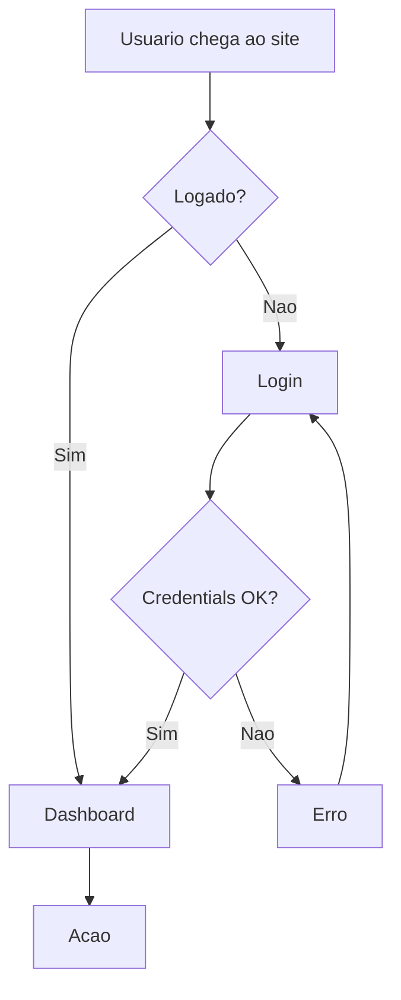

**Direcoes**: `TD` (top-down), `LR` (left-right), `BT` (bottom-top), `RL` (right-left).

**Shapes**: `[Quadrado]`, `(Arredondado)`, `((Circulo))`, `{Diamond decision}`, `[/Parallelogram/]`, `[\Reverse parallelogram\]`.

#### Sequence Diagram

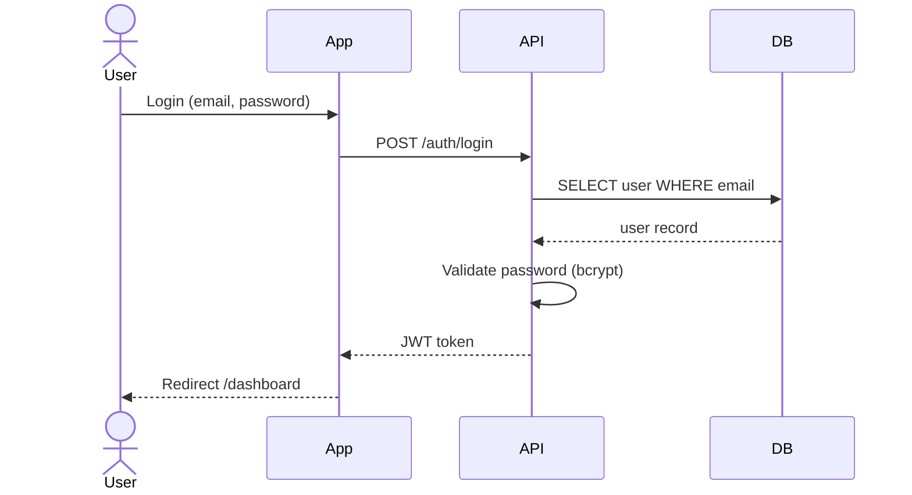

**6 estilos de seta**:
- `->>` solid arrow (sync request)
- `-->>` dashed arrow (response)
- `-x` solid X (error)
- `--x` dashed X (failed response)
- `-)` async (open arrow)
- `--)` async dashed

#### ER Diagram (database schema)

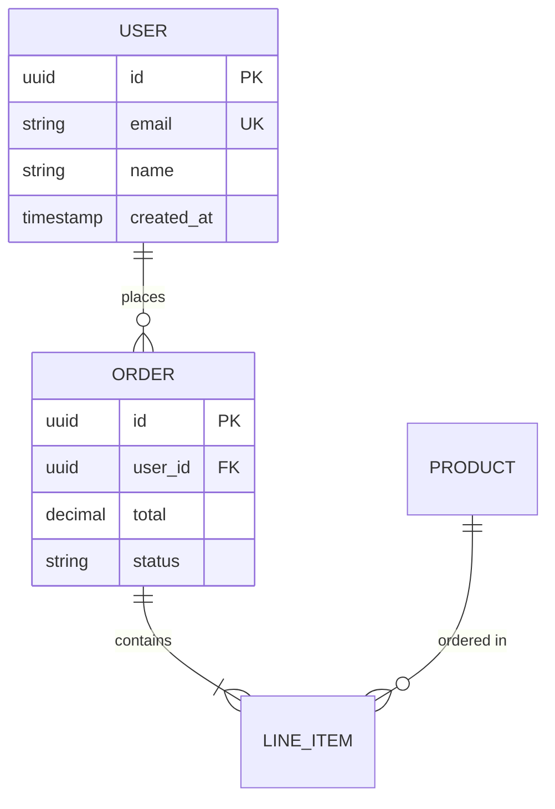

**Cardinality**:
- `||` exactly one
- `o|` zero or one
- `|{` one or more
- `o{` zero or more

Examples: `||--||` (1:1), `||--o{` (1:N), `}o--o{` (N:M).

#### Customer Journey

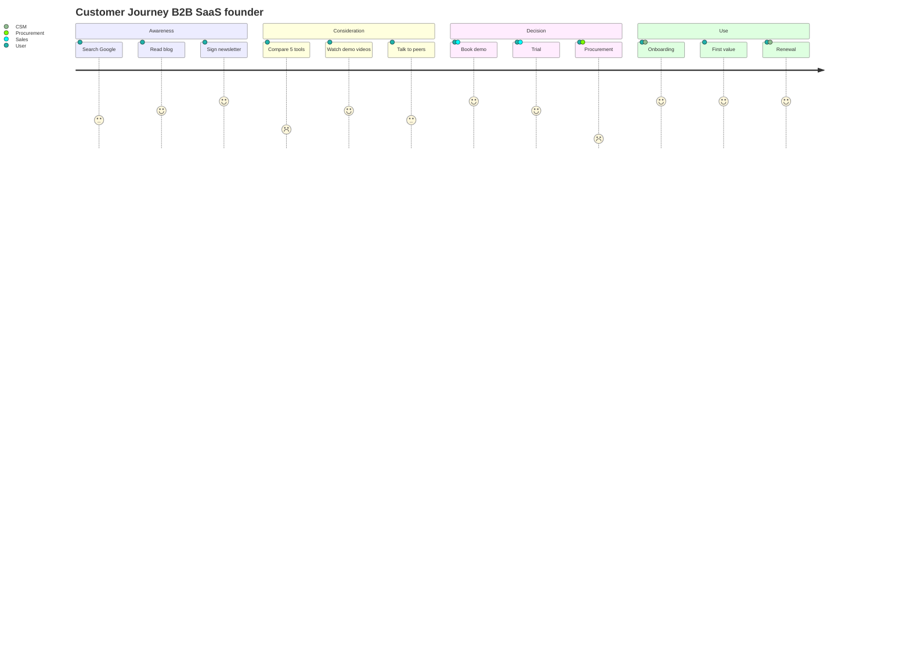

(Score 1-5 para emocao em cada touchpoint.)

#### Timeline

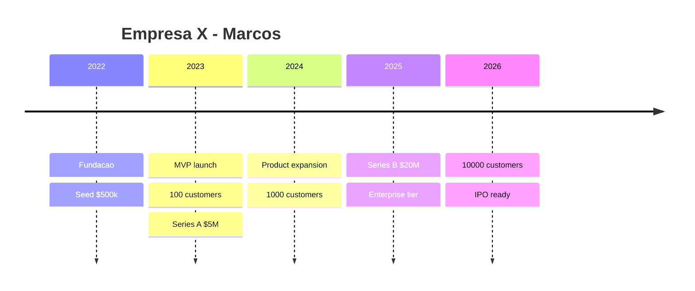

#### Gantt (project timeline)

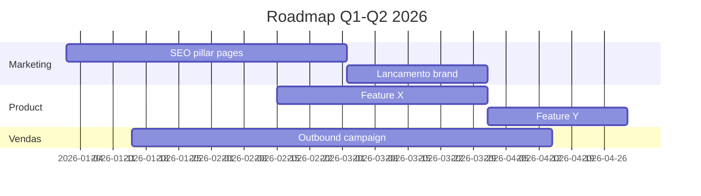

#### MindMap

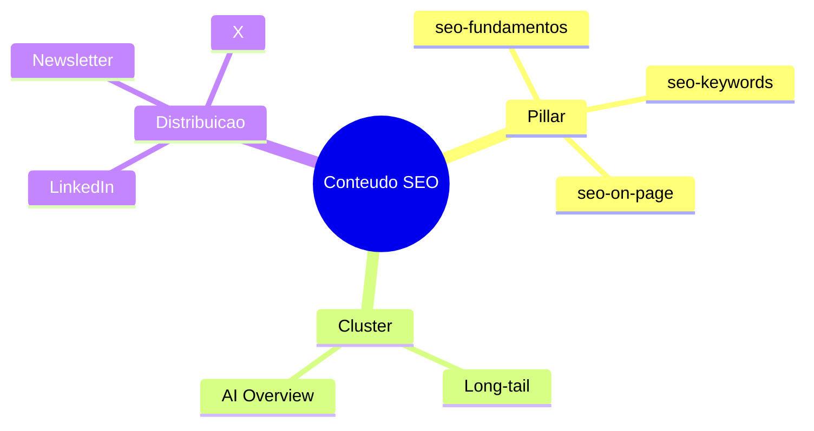

#### Quadrant Chart (2x2 matriz)

```mermaid
quadrantChart
    title Priorizacao backlog (Esforco x Impacto)
    x-axis Baixo Esforco --> Alto Esforco
    y-axis Baixo Impacto --> Alto Impacto
    quadrant-1 Quick Wins (Faca AGORA)
    quadrant-2 Major Projects (Planeje)
    quadrant-3 Fill-ins (Quando sobrar tempo)
    quadrant-4 Avoid (Reavalie)
    Refresh pillar SEO: [0.3, 0.8]
    Lancar produto novo: [0.9, 0.9]
    Reformular footer: [0.2, 0.1]
    Migrar CRM: [0.8, 0.4]
```

#### Pie Chart

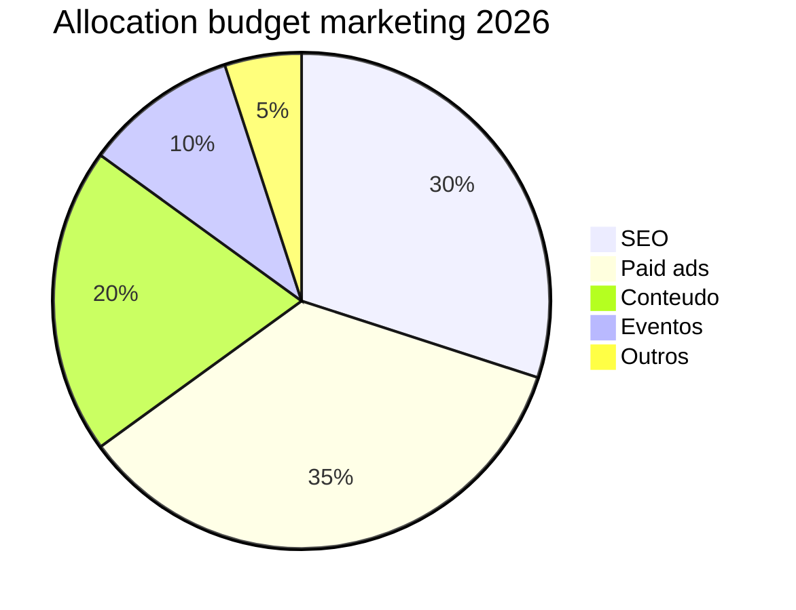

#### Architecture Diagram (NOVO 2026)

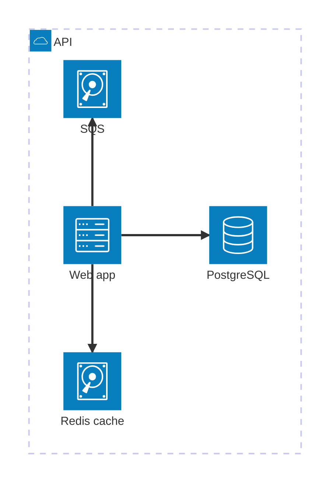

### 2.4 Layout e look (NOVO 2026)

Mermaid restruturou renderer:
- `%%{init: {'theme': 'dark'} }%%` — temas
- `%%{init: {'flowchart': {'curve': 'basis'} } }%%` — curvas
- `%%{init: {'look': 'handDrawn'} }%%` — sketch-style (NOVO 2026)

### 2.5 Mermaid Live Editor

https://mermaid.live — editar e preview em tempo real, exportar SVG/PNG.

**Workflow recomendado**:
1. Rascunhar com Claude (gera Mermaid via prompt).
2. Refinar em Mermaid Live Editor.
3. Copiar codigo para Markdown (GitHub/Notion/blog).
4. Render automatico.

---

## 3. PlantUML — quando usar

### 3.1 PlantUML vs Mermaid — decision

```
USE MERMAID (90% dos casos):
   - Documentacao em Markdown (GitHub/Notion/Obsidian)
   - Diagramas rapidos para post/blog
   - Equipe nao-tecnica (syntax mais facil)
   - Integration nativa em ferramentas dev modernas

USE PLANTUML (10% casos especialistas):
   - UML formal (regulated industries — saude, financas, defesa)
   - C4 model architecture (4 niveis: Context, Container, Component, Code)
   - Universidade / academic
   - Network topology maps
   - Pixel-level layout control necessario
   - Equipe ja domina PlantUML
```

### 3.2 PlantUML strengths

- **30+ diagram types** vs Mermaid 20+
- **C4 model native** (4 niveis arquitetura)
- **Component/Deployment/Timing diagrams** UML formal
- **Network maps** com componentes
- **Sequence diagrams complexos** (best in class)
- **Layout control** mais granular

### 3.3 Setup PlantUML

```
ONLINE:
   - PlantUML Server: https://plantuml.com/plantuml
   - PlantText: https://www.planttext.com

LOCAL:
   - Java + plantuml.jar
   - VS Code extension
   - IntelliJ plugin

INTEGRATION:
   - GitHub: nao native (precisa CI/CD que renderize)
   - GitLab: native (desde 2022)
   - Confluence: plugin
   - Asciidoc: native
```

### 3.4 PlantUML — exemplo C4 model

```
@startuml
!include https://raw.githubusercontent.com/plantuml-stdlib/C4-PlantUML/master/C4_Container.puml

Person(user, "Cliente", "Usa o produto via web")
System_Boundary(produto, "Produto SaaS") {
    Container(web, "Web App", "React/Next.js", "Interface usuario")
    Container(api, "API", "Node.js", "Logica negocio")
    ContainerDb(db, "Database", "PostgreSQL", "Persistencia")
    Container(queue, "Queue", "SQS", "Async jobs")
}
System_Ext(stripe, "Stripe", "Pagamentos")
System_Ext(sendgrid, "SendGrid", "Emails")

Rel(user, web, "Usa", "HTTPS")
Rel(web, api, "Calls", "REST")
Rel(api, db, "Reads/writes", "SQL")
Rel(api, queue, "Publishes", "AWS SDK")
Rel(api, stripe, "Charge", "REST")
Rel(api, sendgrid, "Send email", "REST")
@enduml
```

### 3.5 Best practice — usar AMBOS

Equipes maduras usam **Mermaid + PlantUML complementares**:
- **Mermaid** para diagramas inline em PRs, docs rapidas, blog posts.
- **PlantUML** para architecture decision records (ADRs), C4 formal, audit-trail.

---

## 4. Visual builders — quando

### 4.1 Quando usar visual (vs codigo)

| Cenario | Visual ou Codigo? |
|---------|-------------------|
| Diagrama tecnico para dev | **Mermaid/PlantUML** (codigo) |
| Infografico marketing pretty | **Visual** (Canva/Piktochart/Visme) |
| Sketch rapido brainstorming | **Excalidraw** (sketch-style) |
| Whiteboard collaborative | **Miro/FigJam/Mural** |
| Wireframe app | **Figma** (UI specifico) |
| Architecture enterprise | **Lucidchart** (templates AWS/Azure) |
| Customer journey complexo | **UXPressia/Smaply/TheyDo** |

### 4.2 Excalidraw — sketch-style

- **Free** + open-source
- Aparecia hand-drawn (intencionalmente nao-pixel-perfect)
- Otimo para brainstorming + arquitetura inicial + retros
- Export PNG/SVG
- Collaborative real-time

### 4.3 Draw.io / diagrams.net

- **Free** (mesmo enterprise)
- 1000+ shapes (AWS, Azure, GCP, Cisco, redes)
- Integracao Google Drive, GitHub, Confluence, OneDrive
- Best free alternative to Lucidchart

### 4.4 Lucidchart

- **Enterprise paid** ($9-20/user/mes)
- Templates polished (BPMN, UML, fluxogramas, mind maps)
- Live collaboration
- Integration Salesforce, Atlassian, Office365

### 4.5 Miro / FigJam / Mural

- **Whiteboard collaborative** real-time
- Sticky notes + frameworks pre-built
- Customer journey, retros, brainstorming
- Miro $8/user/mes; FigJam free com Figma

---

## 5. AI infographic tools 2026 (visual builders)

### 5.1 Comparativo

| Ferramenta | Forca | Pricing | Best for |
|-----------|-------|---------|----------|
| **Pikto AI (Piktochart)** | Generate from PDF/text/topic em 10s | $14/mes Pro | Business communication, reports, B2B |
| **Canva Magic Design** | Free + AI features social-first | Free / $13/mes Pro | Personal branding, social, simples |
| **Visme** | Animation + interactive embeds | $24.75/mes | Teams, animado, interativo |
| **Infogram** | Data viz + real-time data | $19-67/mes | Reports data-heavy |
| **Venngage** | Templates infografico amplos | $19/mes | Diversos templates pre-built |
| **Adobe Express** | Adobe ecosystem | $9.99/mes (free tier) | Designers Adobe |
| **Mokup.io / Bit.ai** | Mockups + docs | Variavel | Mockups produto |

### 5.2 Workflow Pikto AI tipico

```
1. INPUT (3 opcoes):
   a) Prompt texto: "Crie infografico sobre AARRR Pirate Metrics"
   b) Upload PDF: artigo / report
   c) Upload spreadsheet: dados raw

2. AI PROCESSA (~10 segundos):
   - Identifica estrutura
   - Escolhe layout
   - Gera charts
   - Aplica brand kit (se uploaded)

3. OUTPUT: infografico editavel em editor Piktochart

4. REFINE:
   - Ajustar cores
   - Trocar icons
   - Editar texto
   - Adicionar logo

5. EXPORT: PNG, JPG, PDF, SVG
```

### 5.3 Canva Magic Design

```
WORKFLOW:

1. Prompt em linguagem natural:
   "Infografico vertical sobre 5 etapas de funil B2B SaaS,
    cores #1A73E8 #00C853 #FFFFFF, tom premium B2B,
    Instagram Story 9:16"

2. Canva gera 4-6 designs em segundos

3. Edit no Canva editor (drag-drop)

4. Brand Kit aplicado automatic se Pro

5. Export multi-formato

CAVEAT: Magic Design ainda inferior a Pikto para infografico
denso/business — Canva brilha em social posts simples.
```

### 5.4 Quando usar cada

```
PIKTO AI:
   - Business reports
   - Whitepapers
   - Annual review
   - Sales decks
   - Educational content denso

CANVA MAGIC:
   - Posts social media
   - Stories Instagram
   - Pinterest pins
   - Quote cards
   - Personal branding

VISME:
   - Apresentacoes animadas
   - Interactive embeds (web)
   - Reports HTML
   - Video presentations

INFOGRAM:
   - Charts data-heavy
   - Dashboards
   - Real-time data
   - Reports financeiros
```

---

## 6. Customer Journey Map — framework + viz

### 6.1 B2B vs B2C — diferenca critica

```
B2C JOURNEY                    B2B JOURNEY
   |                              |
1 pessoa                       6-10 stakeholders (buying committee)
Decisao em minutos             Decisao em meses
Linear (mostly)                Loops nao-lineares
1 emocao a track               Multi-personas, multi-emocoes
Funnel classico OK             Account-based, complex paths
```

### 6.2 7 stages classicos

```
1. NEED          (problema reconhecido)
2. ORIENTACAO    (pesquisa solucoes)
3. CONSIDERACAO  (compara opcoes)
4. DECISAO       (escolhe)
5. DELIVERY      (compra/onboarding)
6. USE           (utiliza produto)
7. LOYALTY       (renova/recomenda)
```

### 6.3 Componentes de um journey map

| Linha (row) | O que mostra |
|-------------|--------------|
| **Stages** | As 7 etapas (need → loyalty) |
| **Touchpoints** | Onde interage (Google, demo, email, app) |
| **Stakeholders** (B2B) | Quem participa (engineer, CFO, etc.) |
| **Actions** | O que faz |
| **Thoughts** | O que pensa |
| **Emotions** (line graph) | De hesitante a feliz (1-5) |
| **Pain points** | Onde sofre |
| **Opportunities** | Onde podemos melhorar |

### 6.4 Mermaid `journey` — quick render

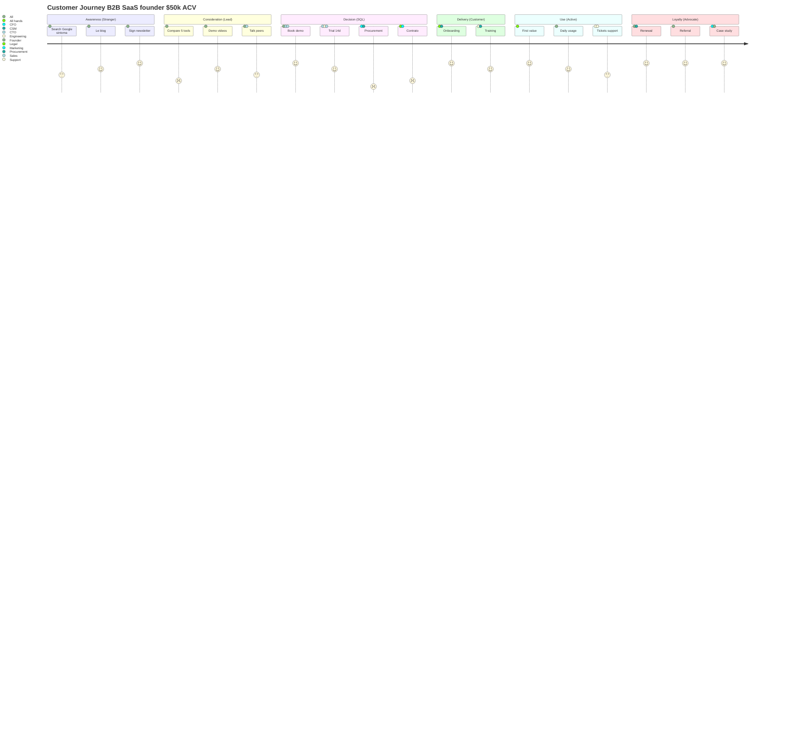

**Score 1-5 = emocao** em cada touchpoint (1 frustrado, 5 muito satisfeito).

### 6.5 Ferramentas dedicadas (alem de Mermaid)

| Ferramenta | Quando usar |
|-----------|-------------|
| **Miro / FigJam** | Start, brainstorming, equipe pequena |
| **UXPressia** | Persona libraries, multi-journey |
| **Smaply** | Impact scoring, persona-driven |
| **TheyDo** | Enterprise, journey ops, multi-product |
| **Lucidchart** | BPMN-style |

---

## 7. AARRR Pirate Metrics — funnel marketing visualizado

### 7.1 Framework (Dave McClure 2007)

```
AAARRR (com Awareness adicionado por Growth Tribe 2016)

Awareness    → Quantos sabem que existimos?
Acquisition  → Quantos visitam / signup?
Activation   → Quantos tem primeira boa experiencia?
Retention    → Quantos voltam?
Referral     → Quantos indicam?
Revenue      → Quantos pagam?
```

### 7.2 Mermaid funnel

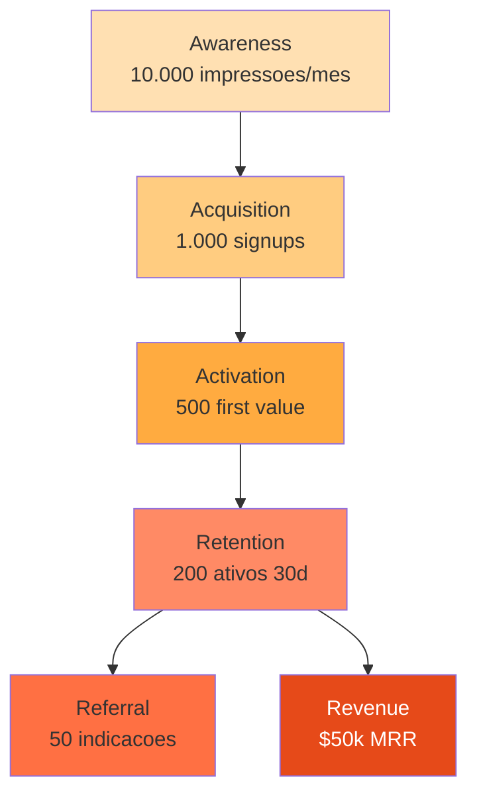

### 7.3 Metricas-chave por etapa

```
AWARENESS
   - Impressoes
   - Reach
   - Brand search lift
   - Share of voice

ACQUISITION
   - Signups
   - Signup rate
   - CAC (cost per acquisition)
   - Channel mix

ACTIVATION
   - Activation rate (% que completou onboarding)
   - Time-to-first-value
   - "Aha moment" hit rate

RETENTION
   - Day 1, 7, 30 retention
   - Churn rate
   - DAU/MAU ratio
   - NPS

REFERRAL
   - Viral coefficient (k-factor)
   - NPS promoters
   - Referral rate
   - Brand ambassador count

REVENUE
   - MRR / ARR
   - LTV
   - LTV/CAC ratio
   - ACV (Annual Contract Value)
   - Payback period
```

### 7.4 Dashboard tools

- **PostHog** — open-source product analytics
- **Amplitude** — product analytics enterprise
- **Mixpanel** — product analytics
- **Geckoboard** — dashboard simples (great for AARRR)
- **Looker Studio** (Google Data Studio) — free
- **Metabase** — open-source BI

---

## 8. Marketing funnels visualizados

### 8.1 Funnels classicos

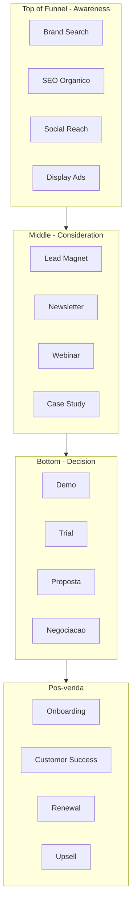

### 8.2 RevOps funnel B2B SaaS

```
Lead → MQL → SAL → SQL → Opportunity → Closed-won → Onboarded → Churn-or-Renewed

Conversao tipica B2B SaaS:
   Lead → MQL: 30%
   MQL → SAL: 50%
   SAL → SQL: 60%
   SQL → Opp: 70%
   Opp → Won: 25-30%
```

### 8.3 BCG Matrix (priorizacao)

```mermaid
quadrantChart
    title BCG Matrix - Portfolio produto
    x-axis Baixo Market Share --> Alto Market Share
    y-axis Baixo Crescimento --> Alto Crescimento
    quadrant-1 Stars (invest)
    quadrant-2 Question Marks (avaliar)
    quadrant-3 Dogs (divest)
    quadrant-4 Cash Cows (milk)
    Produto A: [0.8, 0.9]
    Produto B: [0.3, 0.8]
    Produto C: [0.9, 0.3]
    Produto D: [0.2, 0.2]
```

### 8.4 Eisenhower Matrix (priorizacao tempo)

```mermaid
quadrantChart
    title Eisenhower - Priorizacao tasks
    x-axis Nao Urgente --> Urgente
    y-axis Nao Importante --> Importante
    quadrant-1 SCHEDULE (importante nao urgente)
    quadrant-2 DO (importante urgente)
    quadrant-3 DELEGATE (nao importante urgente)
    quadrant-4 ELIMINATE (nao importante nao urgente)
    Strategy planning: [0.2, 0.9]
    Crisis response: [0.95, 0.95]
    Email triagem: [0.7, 0.3]
    Social scrolling: [0.2, 0.1]
```

---

## 9. Principios de design infografico 2026

### 9.1 Strategic minimalism

```
NAO mostrar todos os dados.
Highlight RIGHT data.

CHECK:
   - Cada elemento serve o ponto principal?
   - Posso remover sem perder mensagem?
   - White space respira?
   - Hierarquia clara em 3 segundos?
```

### 9.2 Storytelling linear

```
TIMELINE = formato MAIS forte 2026 para storytelling

   Eficaz:
   1. Setup do problema (passado)
   2. Catalisador (mudanca)
   3. Conflito (tensao)
   4. Resolucao (presente)
   5. Insight (futuro/CTA)
```

### 9.3 Hierarquia visual em 3 segundos

```
HEADER (5-7 palavras max, 60-100pt)
   ↓
KEY STAT / VISUAL (impacto imediato)
   ↓
NARRATIVE (3-5 pontos)
   ↓
SOURCE / CTA (8-12pt rodape)
```

### 9.4 Cores com proposito (cf. `composicao-visual` proxima skill)

```
PALETA INFOGRAFICO TIPICA (3-5 cores):
   - 1 cor PRIMARY (brand)
   - 1 cor SECONDARY (contraste)
   - 1 cor ACCENT (highlight)
   - 1-2 NEUTRAL (background, text)

EXEMPLO B2B SaaS:
   #1A73E8 (azul primary)
   #00C853 (verde secondary - growth)
   #FF6F00 (laranja accent - critical)
   #FAFAFA (background)
   #212121 (text)
```

### 9.5 Tendencias visuais 2026

- **Strategic minimalism** continua dominante
- **Organic shapes** (vs geometric rigid)
- **Hand-drawn elements** (humanizar IA-generated content)
- **3D elements** (depth, modernidade)
- **Animated infographics** (Visme strong em embed web)
- **Interactive infographics** (Hover, scroll-triggered reveals)
- **Dark mode** infographics (premium, tech)
- **Bold typography** as central element
- **Asymmetric layouts** (vs grid rigido)

### 9.6 Anti-patterns infografico

| Anti-pattern | Por que e problema |
|--------------|---------------------|
| 30+ stats em 1 infografico | Cognitive overload, ninguem absorve |
| Texto < 12pt | Mobile-unreadable |
| Cores conflitantes | Visual noise |
| Sem white space | Caotic |
| Pie chart com 8+ slices | Pizza chart impossivel |
| 3D em pie chart | Distorce dados |
| Source missing | Sem credibilidade |
| Brand inconsistency | Confunde reconhecimento |
| Texto sobre imagem complexa | Ilegivel |
| Estilo "Power Point 2010" | Datado |

---

## 10. Use cases marketing — workflows operacionais

### 10.1 Pillar page SEO com infografico no topo

```
WORKFLOW (cf. seo-on-page Sec 16.1)

1. PILLAR sobre tema denso (ex.: "AARRR Pirate Metrics guia completo")

2. INFOGRAFICO TOPO:
   - Capa visual atrativa (Pikto AI ou Canva)
   - Resumo 6 etapas AARRR
   - Stats-chave embedded
   - CTA "Save / Share"

3. SCHEMA ImageObject (cf. seo-on-page Sec 10.6)

4. ALT TEXT descriptive:
   "Infografico AARRR Pirate Metrics 2026: 6 etapas
   Awareness, Acquisition, Activation, Retention, Referral, Revenue
   com metricas-chave por etapa"

5. EMBED CODE para outras sites compartilharem
   (link de volta = backlink natural)
```

### 10.2 LinkedIn carousel educational

```
LINKEDIN CAROUSEL (cf. linkedin-organico Sec 5)
   - Format top 2026: 6.60% engagement (3x video)
   - Sweet spot 7-10 slides

WORKFLOW:
1. CLAUDE: gerar 10 conceitos de slides + Mermaid diagrams
2. PIKTO AI: design final cada slide
   OU
   FIGMA: design custom slide-a-slide
3. EXPORT PDF (LinkedIn carousel native)
4. Publicar como Document Post
```

### 10.3 Sales deck B2B com C4 architecture

```
SALES DECK B2B SaaS Enterprise

SLIDE 1: Capa
SLIDE 2: Problema (story)
SLIDE 3: Solucao (high-level)
SLIDE 4: COMO FUNCIONA — C4 model architecture (PlantUML)
   - C4 Context: como produto se encaixa no ecosystem cliente
   - C4 Container: containers internos
SLIDE 5: Casos de uso
SLIDE 6: Demo
SLIDE 7: Pricing
SLIDE 8: Roadmap (Mermaid Gantt)
SLIDE 9: Time
SLIDE 10: CTA / Proximos passos
```

### 10.4 Customer journey map para CMO

```
WORKFLOW

1. PESQUISA INTERNA:
   - Entrevistar 5-10 customers (diferentes personas)
   - Sales recordings analise
   - Support tickets analise
   - GA4 + CRM data

2. RASCUNHO em Miro/FigJam (collaborative)

3. REFINE em Smaply ou UXPressia (persona libraries)

4. VERSAO DOC:
   - Mermaid `journey` para incluir em ADRs
   - Visme animado para apresentacao executiva

5. ITERATE quarterly (journey nao e estatico)
```

### 10.5 Dashboard AARRR para CMO

```
TOOLS:
   - Geckoboard (visual simples)
   - Looker Studio (gratis, integration GA4)
   - Amplitude / Mixpanel (product analytics)
   - PostHog (open-source)

LAYOUT:
   Top row: AAARRR funnel (6 metricas top-line)
   Mid row: Funnel conversion rates
   Bottom row: Trend graphs (last 30/90/365 days)

UPDATE: real-time (PostHog/Amplitude) ou daily (manual)
```

---

## 11. Workflow operacional — IA + diagramas

### 11.1 ChatGPT/Claude → Mermaid → render

```
PROMPT:
"Crie um Mermaid sequenceDiagram do fluxo OAuth2 do nosso 
app: User chega em /login, redireciona para Google, retorna
com token, validamos no backend, criamos session, redireciona
dashboard."

CLAUDE OUTPUT:
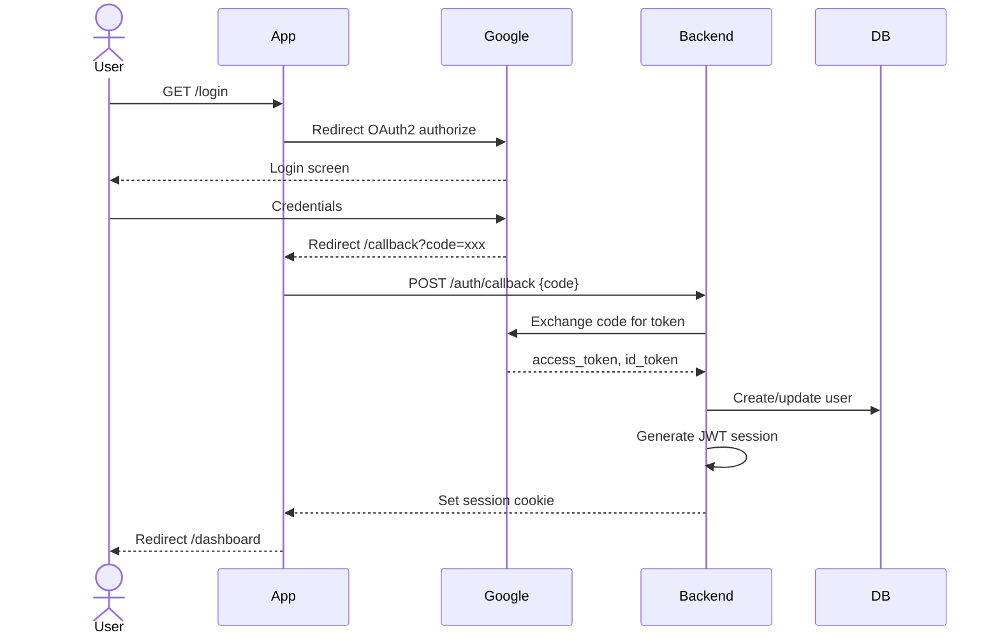

EXECUTAR:
1. Cole codigo em Mermaid Live Editor → preview
2. Iterate se algo errado
3. Cole versao final em Markdown (GitHub/Notion/blog)
4. Render automatico
```

### 11.2 PDF → Pikto AI → infografico

```
WORKFLOW:
1. UPLOAD PDF whitepaper / report (10-30 paginas)
2. Pikto AI processa em ~10s
3. Output: infografico vertical estruturado
4. EDIT: cores, icons, marca
5. EXPORT PNG/PDF/SVG
6. PUBLISH em pillar page / LinkedIn / sales deck
```

### 11.3 Spreadsheet → Infogram → chart

```
WORKFLOW:
1. UPLOAD CSV/Excel com dados
2. Infogram detecta tipo de chart adequado
3. Aplica brand colors
4. Embed code para website (real-time updates)
5. Versao estatica PNG
```

---

## 12. Anti-patterns

| Anti-pattern | Por que e problema |
|--------------|---------------------|
| **PlantUML formal para post LinkedIn** | Overkill — Mermaid serve |
| **Mermaid para C4 enterprise complexo** | PlantUML melhor (formalismo) |
| **Visual builder para diagramas que viverao em git** | Versionamento dificil — usar codigo |
| **Codigo Mermaid para infografico social pretty** | Limitado visualmente — usar Pikto/Canva |
| **Pikto AI sem brand kit** | Saida generica IA-look |
| **Customer journey B2C linear para B2B** | Perde loops + multi-stakeholder |
| **AARRR sem awareness step** | Versao incompleta (Growth Tribe adicionou 2016) |
| **30+ stats em 1 infografico** | Cognitive overload |
| **Pie chart 8+ slices** | Ilegivel |
| **3D em pie chart** | Distorce dados |
| **Sem source citado** | Sem credibilidade |
| **Texto < 12pt** | Mobile unreadable |
| **Mermaid sem layout direction** | Default TD pode nao caber |
| **Diagrama sem alt text** | Acessibilidade + SEO perdido |
| **Embed estatico quando interativo cabe** | Visme/Infogram permitem interatividade |

---

## 13. Templates rapidos Mermaid

### 13.1 Quick decision tree

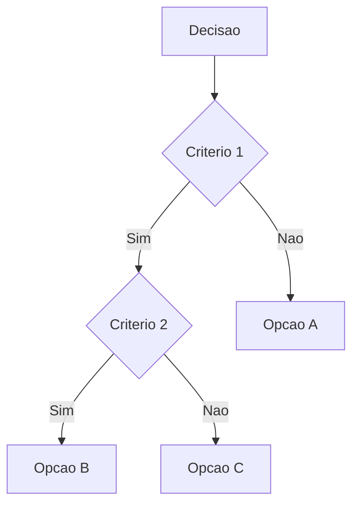

### 13.2 Funnel marketing simples

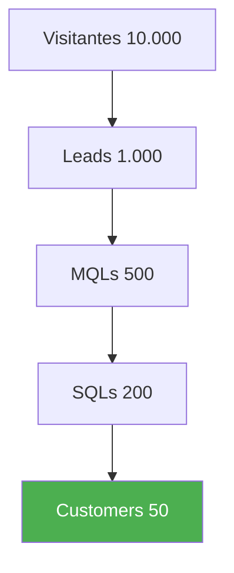

### 13.3 Roadmap Gantt

```mermaid
gantt
    title Roadmap [Tema]
    dateFormat YYYY-MM-DD
    section [Tema 1]
    Tarefa A :2026-01-01, 30d
    Tarefa B :after, 45d
    section [Tema 2]
    Tarefa C :2026-02-15, 60d
```

### 13.4 ERD database

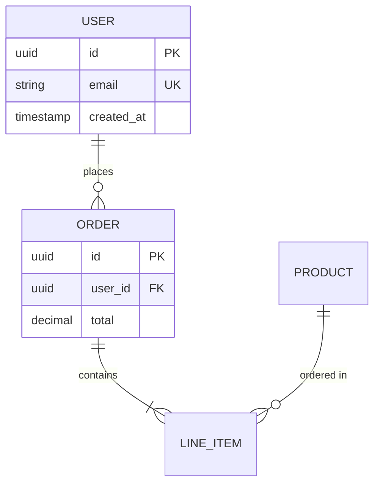

### 13.5 Mind map de conteudo cluster

```mermaid
mindmap
  root((Cluster Tema X))
    Pillar
      Sub 1
      Sub 2
    Spokes
      Spoke A
      Spoke B
      Spoke C
    Distribuicao
      LinkedIn
      Newsletter
      X
```

---

## 14. Regras de Ouro

1. **NAO CHUTAR** — re-validar Mermaid syntax + AI tools features trimestral.
2. **Mermaid default 90% casos** — render nativo GitHub/Notion/GitLab/Confluence.
3. **PlantUML para C4 + UML formal + regulated** (10% casos especialistas).
4. **Diagramas tecnicos = codigo** (Mermaid/PlantUML); **infograficos pretty = visual builder** (Pikto/Canva/Visme).
5. **Pikto AI** para business reports/decks; **Canva** para social; **Visme** para animado/interativo; **Infogram** para data-heavy.
6. **Strategic minimalism** — highlight RIGHT data, nao todos.
7. **Storytelling linear** > grid de stats (timeline forte 2026).
8. **Hierarquia em 3 segundos** — header → stat → narrative → source.
9. **3-5 cores max** + 1-2 neutral = paleta saudavel.
10. **Customer Journey B2B != B2C** — buying committee 6-10 stakeholders, loops nao-lineares.
11. **AARRR com Awareness** (Growth Tribe 2016 update).
12. **C4 model 4 niveis** (Context/Container/Component/Code) para architecture enterprise.
13. **Quadrant chart Mermaid** = priorizacao 2x2 (Eisenhower, BCG, Esforco x Impacto).
14. **Alt text descriptive** em infograficos publicados (acessibilidade + SEO).
15. **Source citado SEMPRE** em data viz (credibilidade).
16. **Brand kit** aplicado em AI tools (Pikto, Canva, Visme) antes de gerar.
17. **Anti-pattern pie chart 8+ slices** ou 3D — usar bar chart.
18. **Iterate** — primeiro rascunho nunca production-ready.

---

## 15. Exemplos comportamentais

### Exemplo 1 — "Mermaid ou PlantUML?"

**Input:** "Documentacao tecnica startup B2B SaaS. Mermaid ou PlantUML?"

**Resposta esperada:**

> **Mermaid default**, salvo cenarios especificos. **Razao quantitativa 2026**: (a) **Render nativo** GitHub, GitLab, Notion, Confluence, Obsidian, MkDocs, Docusaurus, VS Code, JetBrains — sem tooling extra; (b) Syntax markdown-like = adopcao facil pelo time (vs PlantUML steeper learning curve); (c) **20+ tipos** de diagrama suportados (flowchart, sequence, ERD, journey, gantt, timeline, state, mindmap, quadrantChart, C4, architecture novo 2026); (d) Claude excelente em gerar Mermaid via Artifacts panel; (e) Versionamento em git nativo. **Quando PlantUML vence**: (1) **C4 model architecture formal** (4 niveis Context/Container/Component/Code) — PlantUML library mais madura; (2) **Regulated industries** (saude, financas, defesa) onde UML formal e exigido por compliance; (3) **Network topology maps** com componentes especificos; (4) **30+ tipos UML** (component, deployment, timing) que Mermaid nao tem. **Best practice**: usar **AMBOS complementares** — Mermaid para inline em PRs/blog/docs rapidas; PlantUML para Architecture Decision Records (ADRs) formais e C4 enterprise. **Para sua startup B2B SaaS**: **Mermaid 95% do tempo**. Setup: README.md GitHub com Mermaid blocks + Claude para gerar diagrams. Custo: zero. Quando customer enterprise pedir formal architecture doc: usar PlantUML para C4. Realista: 90% dos diagrams diarios = Mermaid; 10% = PlantUML especialista.

**Comportamento-chave:** confirma Mermaid default, lista 4 cenarios PlantUML, recomenda hibrido, alinha com perfil startup.

### Exemplo 2 — "Infografico para pillar page SEO"

**Input:** "Vou publicar pillar de 4.000 palavras sobre 'AARRR Pirate Metrics'. Quero infografico no topo. Como fazer?"

**Resposta esperada:**

> Pillar denso + infografico topo = combinacao **forte para SEO + AI Overview citation + LinkedIn carousel cross-post**. **Workflow recomendado** (3-5 horas total): (1) **CONTENT STRUCTURE primeiro** — definir 6 etapas AARRR + 2-3 stats-chave por etapa (ex.: Awareness: brand search lift; Acquisition: CAC $150; Activation: 60% rate; etc.); (2) **MERMAID JOURNEY ou FLOWCHART** primeiro (rascunho rapido para validar estrutura) — Claude gera em minutos; (3) **PIKTO AI** ou **CANVA** para versao final visual — upload do rascunho Mermaid + brand kit + prompt: "Infografico vertical Pinterest-style sobre 6 etapas AARRR Pirate Metrics, cores [brand], stats-chave por etapa, CTA Save no rodape"; Pikto AI processa em ~10s, output editavel; (4) **REFINE** cores brand + icons + text-on-image; (5) **EXPORT** 3 formatos: (a) PNG vertical 1200×3600 para pillar page topo; (b) PDF carousel 7-10 slides para LinkedIn document post; (c) SVG (se possivel) para escalavel; (6) **SCHEMA ImageObject** + **alt text descriptive**: "Infografico AARRR Pirate Metrics 2026: 6 etapas Awareness, Acquisition, Activation, Retention, Referral, Revenue com metricas-chave"; (7) **EMBED CODE** disponivel para outras sites compartilharem (link de volta = backlink natural). **Custo**: $14/mes Pikto Pro = ~R$ 70 + 3-5 horas trabalho. **ROI**: pillar com infografico recebe 2-3x mais time-on-page (cf. seo-fundamentos), 3x mais saves LinkedIn (cf. linkedin-organico Sec 5), maior chance AI Overview citation (cf. seo-ai-otimizacao). **Bonus** — quando publicar: anuncia com tweet de imagem standalone do infografico (visual = +130% engagement em X).

**Comportamento-chave:** workflow 7 etapas, multi-formato output, integracao com 4+ skills, projeta ROI.

### Exemplo 3 — "Customer journey B2B — como visualizar?"

**Input:** "B2B SaaS ACV $80k. Quero customer journey map para CMO. Como?"

**Resposta esperada:**

> B2B journey **NAO e linear** — buying committee 6-10 stakeholders, loops, meses. **Workflow recomendado** (1-2 semanas): (1) **PESQUISA INTERNA** (3-5 dias): entrevistar 5-10 customers que fecharam ultimos 6 meses (mix won + lost); analise sales call recordings (Gong/Chorus); analise support tickets; GA4 + CRM data; **identificar 3 personas** dentro do buying committee tipico (ex.: CTO tecnico, CFO financeiro, Champion intermediario); (2) **RASCUNHO COLLABORATIVE** (1 dia em workshop): Miro ou FigJam com sales + CSM + product + marketing — sticky notes por stakeholder x stage; (3) **REFINE em ferramenta dedicada** (2-3 dias): UXPressia (persona libraries built-in) ou Smaply (impact scoring) — para B2B enterprise considerar TheyDo; (4) **VERSAO MERMAID** para incluir em docs/ADRs: usar `journey` syntax simplificado; (5) **VERSAO VISUAL** para apresentacao CMO: Visme animado OU Figma custom; (6) **COMPONENTES OBRIGATORIOS** no map: stages (7 classicos: need/orientacao/consideracao/decisao/delivery/use/loyalty), touchpoints (Google search, demo, email, slack, etc.), **stakeholders por stage** (CTO entra em DEMO, CFO em CONTRACT, CSM em ONBOARDING), actions, thoughts, **emotion line graph 1-5** por touchpoint (revela vales de frustracao), pain points, opportunities; (7) **ITERATE quarterly** — journey nao e estatico, atualiza com dados novos. **OUTPUT**: 3 entregaveis: (a) journey map visual (PDF/PNG); (b) journey-as-data (planilha com touchpoints, stakeholders, friction); (c) action plan (top 5 oportunidades de melhorar journey, atribuidas a teams). **Realista para CMO**: 1-2 semanas full process; ROI = identificar 3-5 friction points concretos que melhorando aumentam closed-won 10-30%. **NAO**: B2C linear funnel para B2B (perde 80% da nuance); journey one-shot sem iteracao quarterly.

**Comportamento-chave:** estrutura processo 7 etapas, 3 personas dentro de buying committee, 3 entregaveis output, alerta anti-patterns B2C.

### Exemplo 4 — "Dashboard AARRR para CMO — qual ferramenta?"

**Input:** "CMO pediu dashboard AARRR weekly. Sem dev disponivel. Qual ferramenta?"

**Resposta esperada:**

> **Looker Studio** (Google Data Studio) primeira escolha sem dev. Razao: (a) **Free** + integration nativa GA4 + Search Console + BigQuery + Sheets; (b) Drag-and-drop sem SQL para metricas basicas; (c) Templates AARRR disponiveis em galeria; (d) Schedule reports email weekly automatic; (e) Compartilhamento similar Google Docs; (f) White-label para clientes. **Setup 4-8 horas**: (1) **CONECTAR FONTES**: GA4 (acquisition + retention), Stripe (revenue), HubSpot/Salesforce CRM (leads/MQL/SQL/Won), Mixpanel/Amplitude se ja usa (activation); (2) **CRIAR LAYOUT AARRR**: 6 cards top-line (Awareness reach, Acquisition signups, Activation rate, Retention 30d, Referral NPS, Revenue MRR); 6 charts trend last 90 days; tabela detalhada por canal; (3) **METRICAS-CHAVE**: por etapa (cf. Sec 7.3 desta skill); (4) **AUTOMATION**: schedule report email CMO toda segunda 9h + on-demand link compartilhavel; (5) **ITERATE** monthly conforme CMO feedback. **Alternativas**: **Geckoboard** ($29/mes) para dashboards simples mais polished; **Metabase** (open-source) se time tem dev; **PostHog** (open-source product analytics) se foco activation/retention; **Amplitude/Mixpanel** ($) para product analytics enterprise. **NAO**: tentar fazer em Excel (CMO vai cobrar update manual toda semana — burnout); planilha Sheets sem visualization (CMO scroll horror). **Realista**: dashboard funcional Looker Studio em 1 semana; refinement continuo proximos 2-3 meses; CMO satisfaction quando weekly email funciona automatic. **Bonus**: incluir 1 chart "Forecast vs Actual" — CMOs amam forecast em scope.

**Comportamento-chave:** recomenda Looker Studio com razao, oferece setup 5 etapas, lista alternativas por cenario, alerta anti-pattern Excel.

---

## 16. Checklist de Contraditorio Interno

| # | Pergunta destruidora | O que busca |
|---|----------------------|-------------|
| 1 | **Mermaid OU PlantUML** correto? Mermaid 90%, PlantUML formal/C4/regulated. | Decision tool |
| 2 | **Diagrama codigo OU visual builder**? Codigo se vive em git; visual se infografico pretty. | Format right |
| 3 | **AI infographic tool right** (Pikto business / Canva social / Visme animated / Infogram data)? | Tool right job |
| 4 | **Strategic minimalism** — highlight RIGHT data, nao todos? | Anti-overload |
| 5 | **Hierarquia em 3 segundos** (header → stat → narrative → source)? | Visual hierarchy |
| 6 | **3-5 cores max** + brand kit aplicado? | Visual coerencia |
| 7 | **Customer Journey B2B vs B2C** correto (committee 6-10 stakeholders + loops)? | Framework right |
| 8 | **AARRR com Awareness** (AAARRR Growth Tribe)? Source da framework? | Framework atualizado |
| 9 | **Source citado** em data viz + alt text descriptive? | Credibilidade + SEO |
| 10 | **Iteracao** — primeiro rascunho nunca production-ready? | Production quality |

---

## 17. Referencias canonicas

### 17.1 Diagramas como codigo

- **Mermaid Docs** — https://mermaid.js.org
- **Mermaid Live Editor** — https://mermaid.live
- **PlantUML** — https://plantuml.com
- **PlantUML Server** — https://www.plantuml.com/plantuml
- **PlantText** — https://www.planttext.com
- **C4 Model** — https://c4model.com
- **C4-PlantUML Library** — https://github.com/plantuml-stdlib/C4-PlantUML

### 17.2 Visual builders / AI infographic

- **Piktochart (Pikto AI)** — https://piktochart.com
- **Canva** — https://www.canva.com
- **Visme** — https://visme.co
- **Infogram** — https://infogram.com
- **Venngage** — https://venngage.com
- **Adobe Express** — https://www.adobe.com/express/
- **Excalidraw** — https://excalidraw.com
- **Draw.io / diagrams.net** — https://www.drawio.com
- **Lucidchart** — https://www.lucidchart.com
- **Miro** — https://miro.com
- **FigJam** — https://www.figma.com/figjam/

### 17.3 Customer journey + frameworks

- **UXPressia** — https://uxpressia.com
- **Smaply** — https://www.smaply.com
- **TheyDo** — https://theydo.com
- **Miro Customer Journey templates** — https://miro.com/templates/customer-journey-map/
- **Dreamdata B2B Journey** — https://dreamdata.io/b2b-customer-journey

### 17.4 AARRR / dashboards

- **PostHog AARRR Guide** — https://posthog.com/product-engineers/aarrr-pirate-funnel
- **Geckoboard AARRR Dashboard** — https://www.geckoboard.com/dashboard-examples/executive/aarrr-pirate-metrics-dashboard/
- **Looker Studio** — https://lookerstudio.google.com
- **Metabase** — https://www.metabase.com
- **Amplitude** — https://amplitude.com
- **Mixpanel** — https://mixpanel.com
- **PostHog** — https://posthog.com

### 17.5 Bibliografia

- **Edward Tufte** — "The Visual Display of Quantitative Information"
- **Cole Nussbaumer Knaflic** — "Storytelling with Data"
- **Dan Roam** — "The Back of the Napkin"
- **Information is Beautiful** — David McCandless
- **Cassie Kozyrkov** — "Decision Intelligence" (Google chief decision scientist)

### 17.6 Brasil

- **CONAR** — http://www.conar.org.br
- **LGPD** em customer journey com PII (cf. `compliance-lgpd` plugin juridico)

---

## 18. Referencia cruzada de skills

| Situacao | Skills relacionadas |
|----------|----------------------|
| Pillar page com infografico | `infograficos-diagramas` + `seo-on-page` (Sec 16.1) + `seo-keywords` |
| LinkedIn carousel educational | `infograficos-diagramas` + `linkedin-organico` (Sec 5) |
| C4 architecture sales deck | `infograficos-diagramas` (Sec 3) + `branding` |
| Customer journey map B2B | `infograficos-diagramas` (Sec 6) + `persona-icp` (futura) |
| AARRR dashboard CMO | `infograficos-diagramas` (Sec 7) + `linkedin-ads` + `instagram-ads` |
| Mermaid → SVG | `infograficos-diagramas` + `geracao-imagens-ia` (Sec 5 vector vs bitmap) |
| Brand consistency | `infograficos-diagramas` + `composicao-visual` (proxima skill) + `branding` |
| Data viz com cores | `infograficos-diagramas` + `composicao-visual` (proxima — psicologia cor) |

---

## 19. Integracao com o ecossistema Frank-MKT

- **Acoplamento com `geracao-imagens-ia`** (anterior bloco C) — Claude gera SVG (infografico/diagrama vector) + Mermaid; Midjourney/Imagen gera bitmap (background, hero). Skills complementares.
- **Acoplamento com `composicao-visual`** (proxima bloco C) — cores + hierarquia + tipografia aplicado a infograficos.
- **Acoplamento com `seo-on-page`** — image SEO (alt text descriptive + schema ImageObject) aplicado a infograficos publicados.
- **Acoplamento com `seo-keywords`** — keywords-target em alt text + filename.
- **Acoplamento com `linkedin-organico`** — carousel format domina LinkedIn 2026 (6.60% engagement).
- **Acoplamento com `branding`** — brand kit (cores, tipografia) aplicado em AI tools.
- **Acoplamento com `compliance-lgpd`** — customer journey com PII de cliente real exige consent.
- **Acoplamento com o agente `auditor`** — auditor roda regras PASS/FAIL em infograficos (Mermaid OU PlantUML correto? Strategic minimalism? 3-5 cores? Source cited? Alt text? B2B vs B2C journey? AARRR com Awareness?).
- **Memoria** — `.frank-mkt/visual/<cliente>/<data>/infograficos/`.
- **Contraditorio interno** — Checklist Sec 16.
- **Decaimento temporal** — volatility `medium` (6 meses) — Mermaid syntax estavel + AI tools features mensais.
- **Regra de ouro para `frank-mkt`** — nenhum infografico publicado, decisao Mermaid vs PlantUML, ou customer journey map sai do plugin sem passar por esta skill.

---

> **Aviso:** o plugin `frank-mkt` e um assistente de analise. Recomendacoes desta skill devem ser adaptadas a brand, compliance, recurso disponivel, e validadas em ferramentas atuais antes de aplicar em peca formal. Esta e uma skill de volatility `medium` (6 meses) — re-validar Mermaid syntax + AI tools features. **Princípios de design (strategic minimalism, hierarquia, storytelling) sao estaveis ha decadas**.

---

*Plugin `frank-mkt` — skill `infograficos-diagramas` (v0.1.0)*
*Ultima atualizacao: 2026-05-08*
*Pesquisa de campo: 6 web searches em 2026-05-08 (Mermaid 2026 syntax, PlantUML vs Mermaid 2026, infographic design principles 2026, AI infographic tools, customer journey map B2B/B2C, AARRR Pirate Metrics dashboard)*
